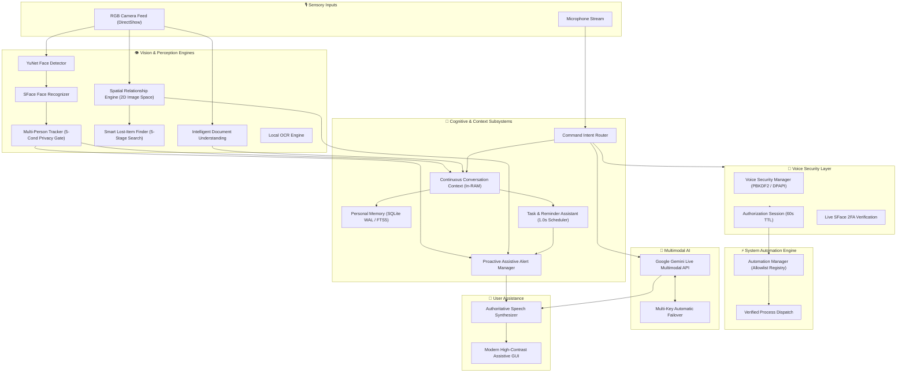

<div align="center">

# 🧊 SG CUBE 2.5

### *Next-Generation Multimodal AI Companion & Assistive Vision System*

<p align="center">

**See. Understand. Remember. Assist.**

</p>

<p align="center">
A real-time, privacy-first multimodal AI vision companion and assistive operating system designed primarily for visually impaired and blind users, providing deep environmental awareness, continuous contextual dialogue, intelligent document reading, and secure voice automation.
</p>

<br>

[](https://www.python.org/)
[](https://ai.google.dev/)
[](https://opencv.org/)
[](https://www.sqlite.org/)
[](https://www.microsoft.com/windows)
[-00ff88?style=for-the-badge&logo=pytest&logoColor=white)](tests/)
[](LICENSE)

<br>

**Voice Security • Personal Memory • Scene Understanding • Lost-Item Finder • Tasks & Reminders • Continuous Context • Multi-Person Awareness • Document Understanding • Safe Automation • Proactive Alerts**

<br>

[✨ 10 Core Features](#-sg-cube-25--10-core-features) •
[💬 What SG CUBE Can Do](#-what-sg-cube-can-do) •
[🛡️ Privacy & Security](#️-privacy--security-architecture) •
[⚠️ Hardware Limitations](#️-hardware-and-depth-perception-notice) •
[🏗️ Architecture](#️-system-architecture) •
[🚀 Installation](#-installation) •
[🧪 Verification](#-testing--verification) •
[👥 Team](#-team--contributors) •
[📜 License](#-license)

</div>

---

# 🌌 Overview

**SG CUBE 2.5** is an intelligent, real-time multimodal AI vision companion and assistive system that brings together **real-time computer vision, continuous contextual conversation, explicit personal memory, environmental scene analysis, document understanding, and permission-based system automation**.

Designed from the ground up for **accessibility, blind and low-vision autonomy, privacy, and safety**, SG CUBE provides intuitive spatial awareness and proactive assistance without requiring visual screens or complex navigation.

---

# ✨ SG CUBE 2.5 — 10 Core Features

### 🔐 1. Voice Security & Password Protection
* **Cryptographic Passphrase Authentication:** Zero plaintext storage using PBKDF2-HMAC-SHA256 (100,000 iterations) with salted hashing and DPAPI-encrypted storage.
* **Three-Tier Policy Model:** Operations categorized into `SAFE`, `PROTECTED` (single-item deletion, memory recall), and `HIGH_RISK` (mass clearing, credential removal).
* **Two-Factor Authentication (2FA):** High-risk actions enforce 2FA combining the spoken knowledge passphrase with verified live facial recognition from OpenCV SFace.
* **Progressive Lockout & Emergency Recovery:** Strict brute-force rate-limiting and one-time emergency recovery codes.

### 🧠 2. Personal Context Memory
* **Explicit Voice Memory Storage:** Users explicitly store facts, locations, and preferences (`"Remember my keys are on the entryway table"`).
* **High-Performance Hierarchical Retrieval:** In-RAM LRU cache (< 0.001 ms), exact SQL indexed lookups (< 0.1 ms), and SQLite FTS5 full-text keyword matching (< 0.3 ms).
* **Automatic Categorization:** Classifies facts into structured categories (`location`, `preference`, `object`, `contact`, `task`, `routine`).
* **Zero Accidental Persistence:** Passive chit-chat is never written to disk without explicit user intent.

### 🧭 3. 2D Scene Understanding & Spatial Grounding
* **Spatial Relationship Engine:** Deterministic pairwise geometric reasoning identifying `ON`, `UNDER`, `INSIDE`, `NEAR`, `FAR`, `LEFT_OF`, `RIGHT_OF`, `ABOVE`, `BELOW`.
* **Surface-Grounding & Object Association:** Groups items by physical support structures (`"on the desk"`, `"on the dining table"`).
* **Truthful Image-Space Positioning:** Describes objects relative to user camera view (`"on your left"`, `"directly ahead"`, `"on your right"`).

### 🔍 4. Smart Lost-Item Finder
* **5-Stage Hierarchical Search:** Evaluates live camera frame → recent visual sighting buffer (120s TTL) → personal memory database → color filtering → honest missing fallback.
* **Transient Observation Tracking:** Stores recent sightings in volatile memory with automatic time-decay and distance estimation.
* **Anti-Hallucination Guarantee:** Never guesses unseen object locations; clearly distinguishes between currently visible items and past sightings.

### 📅 5. Task & Reminder Assistant
* **Natural Language Scheduling:** Parses relative offsets (`"in 20 minutes"`), explicit times (`"at 6:30 PM"`), calendar dates, and recurrence (`daily`, `weekdays`, `every Monday`).
* **Background Scheduler:** Non-blocking 1.0s interval checker with audio chime and non-overlapping voice dispatch.
* **Missed Reminder Recovery:** Automatically detects and alerts users to reminders that matured while the system was offline.

### 💬 6. Continuous Conversation Context
* **Lightweight In-RAM Multi-Turn Tracking:** Maintains transient context across turns without disk persistence.
* **Deterministic Deictic Resolution:** Resolves pronouns (*"it"*, *"that"*, *"there"*, *"the other one"*) to the active object, person, task, or document.
* **Ambiguity Clarification:** Detects underspecified commands and asks targeted clarification questions before taking action.

### 👥 7. Multi-Person Awareness & Tracking
* **Real-Time Track Association:** Multi-person centroid/IoU tracking over RGB camera streams with entry and exit detection.
* **Strict 5-Condition Identity Privacy Gate:** Discloses enrolled names ONLY when:
  1. `state == KNOWN`
  2. `is_confirmed == True` (3 of 5 verification frames)
  3. `liveness_ok == True`
  4. `quality_ok == True`
  5. `identity_name != "Unknown"`
  *(All other persons are announced neutrally as "a person").*
* **Multi-Person Querying:** Answers questions like *"How many people are here?"*, *"Where is everyone?"*, and *"Did someone leave?"*.

### 📄 8. Intelligent Document Understanding
* **Automatic Document Boundary Detection:** Edge detection, perspective rectification, and quality assessment (blur and low-light rejection).
* **Structured Layout Parsing:** Reconstructs reading order across titles, headings, paragraphs, key-value pairs, lists, and tabular rows.
* **Targeted Document Queries:** Answers specific questions (*"Read this document"*, *"What is the total?"*, *"What is the date?"*, *"Read the table"*).
* **Automated PII Redaction:** Masks payment card numbers, Indian Aadhaar numbers, PAN cards, OTPs, and private credentials.

### ⚡ 9. Permission-Based System Automation
* **Strict Allowlist-Only Registry:** Zero support for arbitrary shell, command-line scripts, PowerShell, or `eval`.
* **Safe Application Actions:** Opens/closes approved tools (Calculator, Notepad, File Explorer, Web Browser) and navigates to approved domains.
* **Granular Permissions & Confirmation:** User-configurable permissions (`ALLOWED`, `ASK_EACH_TIME`, `DENIED`) with voice confirmation for protected actions.
* **Document OCR Isolation:** Text extracted from camera documents cannot execute system automation commands.

### 🚨 10. Proactive Assistive Alerts
* **Conservative Temporal Stability:** Requires visual events to persist for 3 of 5 frames ($\ge 0.70$ confidence) before triggering an alert.
* **Fatigue Protection & Rate Limiting:** Global rate limit (maximum 5 spoken alerts per minute) and per-event deduplication cooldowns (15s–60s).
* **User Control & Verbosity Modes:** Configurable modes (`OFF`, `MINIMAL`, `NORMAL`, `ASSISTIVE`) with natural voice pause/resume controls (`"pause alerts for 5 minutes"`).

---

# 💬 What SG CUBE Can Do

### 📍 Finding Everyday Items
> **User:** *"Where is my phone?"*  
> **SG CUBE:** *"Your phone is on the dining table, slightly to your left."*  
> **User:** *"Where is it?"* *(Context Follow-Up)*  
> **SG CUBE:** *"Your phone is on the dining table, slightly to your left."*  
> **User:** *"What is next to it?"*  
> **SG CUBE:** *"There is a cup on the dining table, to the left of the phone."*

### 📄 Reading Documents & Receipts
> **User:** *"Read this document."*  
> **SG CUBE:** *"This is a receipt titled 'Grocery Mart', dated 2026-09-22, with a total of $45.00."*  
> **User:** *"What is the total?"*  
> **SG CUBE:** *"The total amount is $45.00."*

### ⏰ Scheduling Tasks & Reminders
> **User:** *"Remind me to call Mom at 6 PM."*  
> **SG CUBE:** *"I've scheduled a reminder to 'Call Mom' for today at 6:00 PM."*  
> **User:** *"Change it to 7 PM."*  
> **SG CUBE:** *"I've updated your reminder 'Call Mom' to 7:00 PM."*

### 👥 People & Room Awareness
> **User:** *"Who is in front of me?"*  
> **SG CUBE:** *"There is a person standing directly ahead of you."*  
> *(When a verified enrolled friend enters the camera view)*  
> **SG CUBE:** *"Rahul is to your right."*

### 🖥️ Safe System Automation
> **User:** *"Open Calculator."*  
> **SG CUBE:** *"Opening Calculator."*  
> **User:** *"Close it."*  
> **SG CUBE:** *"Do you want me to close Calculator?"*  
> **User:** *"Yes."*  
> **SG CUBE:** *"Calculator has been closed."*

### 🚨 Proactive Assistive Warnings
> *(A chair is obstructing the walkway directly ahead)*  
> **SG CUBE:** *"Caution: chair in the center of camera view."*  
> **User:** *"What was that alert?"*  
> **SG CUBE:** *"The last alert was 10 seconds ago: 'Caution: chair in the center of camera view' based on scene analyzer."*

---

# ⚠️ Hardware and Depth Perception Notice

> [!IMPORTANT]
> **RGB Camera & Spatial Perception Characteristics:**
> * SG CUBE operates using standard **2D monocular RGB webcams and camera streams**.
> * The system performs **2D image-space geometric reasoning** and scale-based proximity heuristics. It does **not** contain hardware LiDAR, time-of-flight (ToF) sensors, or millimeter-wave radar.
> * SG CUBE **cannot detect physical objects located behind the user** or outside the camera's active field of view.
> * Spatial directions (*"on your left"*, *"directly ahead"*, *"on your right"*) describe the orientation of objects within the **camera's visual coordinate space**.

---

# 🛡️ Privacy & Security Architecture

SG CUBE is built with uncompromising user privacy and data security principles:

1. **Local-First Processing:** Computer vision models (YuNet face detection, SFace face recognition, OpenCV spatial engine) execute 100% locally on your machine.
2. **5-Condition Face Privacy Gate:** Unverified or unconfirmed faces are never identified by name; the system safely refers to them as *"a person"*.
3. **Transient In-RAM Context:** Multi-turn conversation context, recent sightings, and proactive queues reside strictly in volatile RAM and automatically expire via time-to-live (TTL) pruning.
4. **Document PII Protection:** High-risk identifiers (payment cards, Aadhaar, PAN, credentials) are automatically scrubbed and redacted before output.
5. **Deny-by-Default System Automation:** System automation is restricted to a curated allowlist with strict input sanitization; arbitrary command execution is completely blocked.
6. **Hardware-Bound Credential Encryption:** Gemini API keys and sensitive settings are secured using Windows DPAPI encryption bound to your user profile.

---

# 🏗️ System Architecture



---

# 🚀 Installation

### Prerequisites
* **Operating System:** Windows 10 or Windows 11 (64-bit)
* **Python Runtime:** Python 3.10, 3.11, 3.12, or 3.13
* **Hardware:** Standard USB/integrated RGB webcam, microphone, speakers/headphones
* **Internet Connection:** Required for Google Gemini Live multimodal reasoning

### 1️⃣ Clone the Repository
```bash
git clone https://github.com/<your-username>/SG-CUBE.git
cd SG-CUBE
```

### 2️⃣ Deploy via Official Windows Installer
Run the automated installer to set up the environment and desktop shortcuts:
```cmd
Install-SG-CUBE.bat
```

Or configure a local virtual environment manually:
```powershell
python -m venv .venv
.venv\Scripts\activate
pip install -r requirements.txt
```

### 3️⃣ Configure Gemini API Keys
Create a `.env` file in the root directory (or use in-app settings):
```env
GEMINI_API_KEY_1=your_primary_api_key
GEMINI_API_KEY_2=your_secondary_api_key_optional
GEMINI_API_KEY_3=your_tertiary_api_key_optional
```

### 4️⃣ Launch SG CUBE
```cmd
run.bat
```
*(Or say **"Hey SG CUBE"** if the background wake listener is active).*

---

# 🧪 Testing & Verification

Run the full regression test suite across all 10 features:

```bash
pytest tests/ -v
```

### Full Subsystem Verification Matrix

| Subsystem / Feature Module | Dedicated Test Module | Tests | Result |
| :--- | :--- | :---: | :---: |
| **Feature 1: Voice Security** | `test_voice_security_password.py` | 35 | ✅ PASS |
| **Feature 2: Personal Memory** | `test_context_memory.py`, `test_memory_manager.py` | 33 | ✅ PASS |
| **Feature 3: Scene Understanding** | `test_scene_understanding.py` | 35 | ✅ PASS |
| **Feature 4: Lost-Item Finder** | `test_smart_object_finder.py` | 35 | ✅ PASS |
| **Feature 5: Tasks & Reminders** | `test_task_reminder.py` | 42 | ✅ PASS |
| **Feature 6: Conversation Context** | `test_conversation_context.py` | 42 | ✅ PASS |
| **Feature 7: Multi-Person Awareness** | `test_multi_person_awareness.py` | 36 | ✅ PASS |
| **Feature 8: Document Understanding** | `test_document_understanding.py` | 39 | ✅ PASS |
| **Feature 9: System Automation** | `test_automation_manager.py` | 56 | ✅ PASS |
| **Feature 10: Proactive Alerts** | `test_proactive_alerts.py` | 57 | ✅ PASS |
| **Core Perception & Lifecycle** | `test_face_*.py`, `test_wake_*.py`, `test_camera_*.py` | 263 | ✅ PASS |
| **TOTAL REGRESSION SUITE** | **All 49 Test Suites Combined** | **673** | **✅ 673 / 673 PASS (100%)** |

---

# 📌 Project Information

| Property | Details |
| :--- | :--- |
| **Project** | **SG CUBE** |
| **Version** | **2.5.0** |
| **Release Status** | **Production Release** |
| **Platform** | Windows 10 / 11 (64-bit) |
| **Primary Language** | Python 3.10+ |
| **AI Vision & Multimodal Engine** | Google Gemini Live + Assistive Perception Suite |
| **Local Neural Models** | OpenCV YuNet (Face Detection) + SFace (Face Recognition) |
| **Database Architecture** | SQLite 3 with Write-Ahead Logging (WAL) & FTS5 |
| **License** | MIT License |

---

# 👥 Team & Authors

### 🚀 Founder & Lead Architect
* **Sharath Gowda U R** ([@sharathgowdaur-jpg](https://github.com/sharathgowdaur-jpg)) — Core System Architecture, Vision AI, Deep Neural Face Engine, Full-Stack Engineering

### 🤝 Contributors
* **Gajanand V Dhayagode** ([@gajanand27-05](https://github.com/gajanand27-05)) — Windows DPAPI hardware-bound security enhancements and dependencies hardening

---

# 📜 License

SG CUBE is distributed under the open-source **MIT License**. See the [`LICENSE`](LICENSE) file for complete details.

<div align="center">

<br>

### **See. Understand. Remember. Assist.**
**SG CUBE 2.5 — Built with ❤️ for accessible, private, and intelligent AI autonomy.**

</div>
