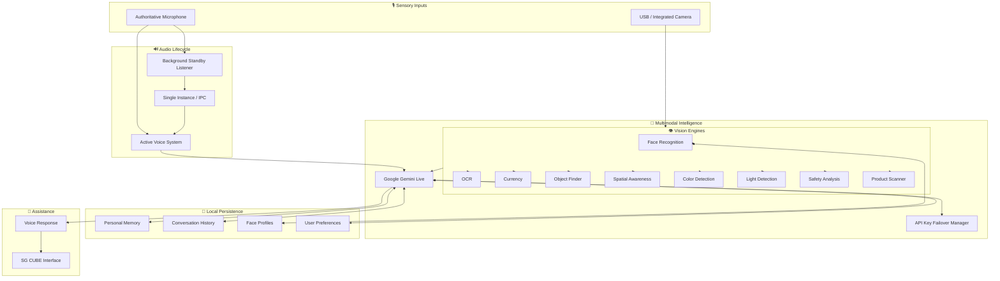

<div align="center">

# 🧊 SG CUBE

### *Next-Generation Multimodal AI Companion & Assistive Vision System*

<p align="center">

**See. Understand. Remember. Assist.**

</p>

<p align="center">
A real-time multimodal AI vision companion and assistive assistant designed primarily for visually impaired and blind users, while also providing general-purpose AI assistance.
</p>

<br>

[](https://www.python.org/)
[](https://ai.google.dev/)
[](https://opencv.org/)
[](https://www.sqlite.org/)
[](https://www.microsoft.com/windows)
[](tests/)
[](LICENSE)

<br>

**Voice • Vision • Memory • Accessibility • Safety • Multimodal AI**

<br>

[✨ Features](#-key-features) •
[🏗️ Architecture](#️-system-architecture) •
[🚀 Installation](#-installation) •
[🎙️ Commands](#️-example-voice-commands) •
[🧪 Testing](#-testing--verification) •
[👥 Team](#-team--contributors) •
[🙏 Attribution](#-original-repository--attribution) •
[📜 License](#-license)

</div>

---

# 🌌 Overview

**SG CUBE** is an intelligent, real-time multimodal AI vision companion and assistive assistant that combines **voice interaction, computer vision, multimodal AI, personal memory, environmental understanding, and local persistence** into a single system.

The project is designed primarily to assist **visually impaired and blind users** through natural voice interaction and camera-based perception while also providing general-purpose AI assistance.

SG CUBE brings together:

* 🎙️ Real-time voice interaction
* 🤖 Google Gemini Live multimodal AI
* 👁️ Real-time computer vision
* 👤 Face detection and recognition
* 🧠 Personal memory
* 💬 Conversation history
* 📖 OCR and text reading
* 💵 Indian currency recognition
* 📦 Object finding
* 🧭 Spatial awareness
* 🌍 Environment and scene understanding
* ⚠️ Safety monitoring
* 🎨 Color detection
* 💡 Light detection
* 📦 Product and medicine scanning
* 🎧 Background wake-word listening
* 💤 Sleep and wake control
* 🔑 Multiple Gemini API key management and failover
* 🔐 Local persistent storage

---

# 🎯 Project Vision

SG CUBE is built around a simple interaction philosophy:

```text
        🎙️ LISTEN
            ↓
       🧠 UNDERSTAND
            ↓
          👁️ SEE
            ↓
        🔍 ANALYZE
            ↓
        🧠 REMEMBER
            ↓
       💬 RESPOND
            ↓
        🤝 ASSIST
```

Instead of depending only on traditional buttons, menus, and text interfaces, SG CUBE provides a **voice-first interaction model supported by real-time visual perception**.

The goal is to make AI assistance feel more natural, contextual, and accessible.

---

# ✨ Key Features

## ⚡ 1. Continuous Multimodal Intelligence

SG CUBE uses **Google Gemini Live** for real-time multimodal interaction.

### Capabilities

* Real-time bidirectional communication
* Streaming audio interaction
* Vision-aware conversation
* Multi-turn dialogue
* Continuous conversation
* Spoken responses
* Low-latency interaction
* Barge-in / interruption
* Dedicated speaker management
* Voice confirmations
* Assistive spoken output

### Example

**User**

> What do you see?

**SG CUBE**

> I can see a person standing in front of you.

---

# 🔑 2. Multi-API Key Failover

SG CUBE supports multiple Gemini API keys for supported quota and transient network failures.

```text
Primary API Key
       ↓
Secondary API Key
       ↓
Tertiary API Key
```

### Features

* Primary / secondary / tertiary key support
* Automatic failover
* Quota-aware recovery
* Network failure handling
* Local key configuration
* Application settings integration

### Example configuration

```env
GEMINI_API_KEY_1=
GEMINI_API_KEY_2=
GEMINI_API_KEY_3=
```

> ⚠️ **Never publish real API credentials.**

---

# 👤 3. Face Detection & Recognition

SG CUBE provides local face recognition using feature embeddings and similarity matching.

### Capabilities

* Real-time face detection
* Multiple face detection
* Bounding boxes
* Face enrollment
* Face recognition
* Unknown-face handling
* Local face profiles
* Profile persistence
* Face profile deletion
* Recognition after restart

### 🧠 Face Memory

Users can explicitly save people into local face memory.

**Example:**

> Save this face as Rahul.

Later:

> Who is this?

SG CUBE can attempt to recognize the enrolled person.

Face profiles are designed to remain local rather than being automatically uploaded to a remote face database.

---

# 👁️ 4. Assistive Computer Vision Suite

| Engine                 | Capability           | Purpose                                        |
| ---------------------- | -------------------- | ---------------------------------------------- |
| 📖 OCR Engine          | Text extraction      | Read documents, labels, signs and visible text |
| 💵 Currency Detector   | Banknote recognition | Identify supported Indian denominations        |
| 📦 Object Finder       | Object detection     | Locate everyday objects                        |
| 🧭 Spatial Awareness   | Relative positioning | Describe left/right/near/far relationships     |
| 🌍 Scene Understanding | Environment analysis | Understand surrounding context                 |
| 🛡️ Safety Analyzer    | Hazard awareness     | Identify potential environmental risks         |
| 🎨 Color Detection     | Color identification | Identify visible colors                        |
| 💡 Light Detection     | Lighting analysis    | Classify ambient lighting                      |
| 📦 Product Scanner     | Packaging analysis   | Process supported product information          |
| 🔎 QR / Barcode        | Code detection       | Detect supported codes                         |

---

# 📖 5. OCR — Text Reading

The OCR engine provides visual text assistance.

### Capabilities

* Text extraction
* Image preprocessing
* Adaptive thresholding
* Multi-line text handling
* Spoken text reading
* Camera-based text assistance

### Example

> Read this.

SG CUBE processes visible text and provides the result through the voice system.

---

# 💵 6. Indian Currency Recognition

SG CUBE includes Indian banknote recognition.

### Supported denominations

* ₹10
* ₹20
* ₹50
* ₹100
* ₹200
* ₹500
* ₹2000

The result can be provided through the assistant's visual and spoken response systems.

---

# 📦 7. Object Finder

SG CUBE can help locate objects in the user's surroundings.

### Example

> Find my phone.

Possible spatial results:

```text
Left
Center
Right

Near
Far
```

---

# 🧭 8. Spatial Awareness

The spatial system provides relative object positioning.

Examples:

* Left
* Center
* Right
* Near
* Far
* Relative position

### Example response

> Your phone is on the right and nearby.

---

# 🌍 9. Environment & Scene Awareness

SG CUBE can analyze the surrounding environment and provide structured information.

Possible information includes:

* People count
* Room/environment context
* Detected objects
* Lighting conditions
* Spatial relationships
* Scene changes

---

# ⚠️ 10. Safety Monitoring

SG CUBE includes assistive safety analysis.

Potential detections include:

* Nearby obstacles
* Close objects
* Stairs and steps
* Collision risks
* Proximity hazards

Safety information can be delivered through the assistant's voice system.

> ⚠️ **SG CUBE is an assistive system and should not be treated as a replacement for emergency services or professional assistance.**

---

# 🎨 11. Color Detection

SG CUBE can identify dominant colors in visible objects and clothing.

### Example

> What color is this?

**Response**

> Blue.

---

# 💡 12. Light Detection

The light analysis system classifies ambient lighting.

Possible states:

```text
Dark
Dim
Normal
Bright
```

### Example

> Is the room dark?

---

# 📦 13. Product & Medicine Scanner

The product scanner can analyze supported packaging and labels.

### Capabilities

* Barcode detection
* QR code detection
* Package text
* Product information extraction
* Expiration-date parsing

### Example

```text
EXP: 08/2027
```

---

# 🎧 14. Background Wake Listener

SG CUBE includes a dedicated background wake listener designed for low-latency standby listening.

### Supported wake phrases

```text
SG CUBE
Hey SG CUBE
S G CUBE
Ess Gee Cube
Es Gee Cube
SG Cub
SG Cue
```

The system is designed to handle reasonable phonetic variations.

### Wake Pipeline

```text
🎙️ Microphone
      ↓
Voice Activity Detection
      ↓
Rolling Audio Buffer
      ↓
Wake Word Matcher
      ↓
Wake Event
      ↓
🧊 SG CUBE
```

The listener uses a two-stage approach:

1. Low-cost speech activity detection
2. Phonetic/acoustic wake-word matching

---

# 🔄 15. Intelligent Application Lifecycle

SG CUBE uses a state-aware voice lifecycle.

### Windows Login

```text
WINDOWS LOGIN
      ↓
Background Listener ON
      ↓
"Hey SG CUBE"
      ↓
SG CUBE Opens
      ↓
Main Voice System Active
      ↓
Background Listener OFF
```

### Sleep

```text
ACTIVE
  ↓
"Go to sleep"
  ↓
Main Microphone OFF
Camera OFF
Gemini OFF
  ↓
Background Listener ON
  ↓
Wait for Wake Word
```

### Closed Application

```text
SG CUBE CLOSED
      ↓
Background Listener ON
      ↓
Wait for Wake Word
      ↓
"Hey SG CUBE"
      ↓
SG CUBE Opens Again
```

### Microphone Ownership

| State           | Main Microphone | Background Listener |
| --------------- | --------------: | ------------------: |
| Windows Login   |             OFF |                  ON |
| Closed          |             OFF |                  ON |
| Sleep           |             OFF |                  ON |
| Open + Active   |              ON |                 OFF |
| System Shutdown |             OFF |                 OFF |

This prevents competing microphone streams.

---

# 🧠 16. Personal Memory

SG CUBE provides persistent local personal memory.

### Example

> Remember my favorite color is blue.

Later:

> What is my favorite color?

**Expected response:**

> Blue.

The memory system supports saving, recalling, and forgetting supported information.

---

# 💬 17. Conversation History

SG CUBE stores multi-session conversation history locally.

The history system can preserve:

* User messages
* Assistant responses
* Conversation sessions
* Session metadata

This allows the application to maintain continuity across sessions.

---

# 👤 18. User Profile

SG CUBE supports first-run user profile setup.

Users can configure:

* Name
* Display name
* Preferences
* Application settings
* API configuration

A fresh setup does not use a hardcoded personal identity.

---

# 🎨 19. Modern AI Interface

SG CUBE is designed around a modern voice-first interaction experience.

The interface can provide:

* Voice interaction feedback
* Listening states
* Thinking states
* Speaking states
* Sleep states
* High-contrast visual hierarchy
* System status information
* Camera/voice interaction feedback

---

# 🏗️ System Architecture



---

# 🏗️ Project Structure

```text
SG-CUBE/
│
├── assistive/
│   ├── api_key_manager.py
│   ├── command_router.py
│   ├── conversation_history.py
│   ├── face_memory.py
│   ├── face_recognition.py
│   ├── memory_manager.py
│   ├── ocr_engine.py
│   ├── currency_detector.py
│   ├── object_detector.py
│   └── vision_engine.py
│
├── tests/
│
├── data/
│   ├── face_memory/
│   ├── history/
│   ├── memory/
│   └── user_preferences/
│
├── visionclaw_gui.py
├── wake_listener.py
├── wake_word_matcher.py
├── requirements.txt
├── .env.example
├── .gitignore
├── LICENSE
└── README.md
```

> Runtime `data/` contents should be created locally and should never contain private user information in the public repository.

---

# 🛠️ Technology Stack

### Programming

* Python 3.10+
* SQLite
* Tkinter

### Artificial Intelligence

* Google Gemini Live
* Multimodal streaming AI
* Conversational AI
* Vision-aware AI

### Computer Vision

* OpenCV
* Face recognition
* OCR
* Object detection
* Image preprocessing
* Spatial reasoning

### Audio

* Microphone streaming
* Voice Activity Detection
* Wake-word matching
* Audio buffering
* Speech output

### Storage

* SQLite
* WAL-based local storage
* Local persistence

### Windows Integration

* Windows startup
* Background wake listener

### IPC

* Single-instance protection
* System tray
* Hardware recovery

---

# 🚀 Installation

## Prerequisites

Recommended:

* Windows 10 or Windows 11
* Python 3.10
* Python 3.11
* Python 3.12
* Python 3.13
* Webcam
* Microphone
* Speaker or headphones
* Internet connection for Gemini Live

---

## 1️⃣ Clone the Repository

```bash
git clone https://github.com/<your-username>/SG-CUBE.git
cd SG-CUBE
```

---

## 2️⃣ Create a Virtual Environment

### Windows

```powershell
python -m venv .venv
.venv\Scripts\activate
```

### Linux/macOS

```bash
python -m venv .venv
source .venv/bin/activate
```

---

## 3️⃣ Install Dependencies

```bash
pip install -r requirements.txt
```

---

# 🔐 Configure Gemini API Keys

## Option 1 — `.env`

Copy:

```text
.env.example
```

to:

```text
.env
```

Then configure:

```env
GEMINI_API_KEY_1=
GEMINI_API_KEY_2=
GEMINI_API_KEY_3=
```

> 🚨 **Never commit `.env` to GitHub.**

## Option 2 — In-App Settings

Launch SG CUBE and use the application settings for API key management where supported.

---

# ▶️ Run SG CUBE

```bash
python visionclaw_gui.py
```

For Windows:

```text
run.bat
```

---

# 🎧 Run Background Wake Listener

For development/testing:

```bash
python wake_listener.py
```

Production deployments can configure the background listener to start automatically with Windows.

---

# 🧪 Testing & Verification

Run the complete test suite:

```bash
pytest tests/
```

Run a specific test:

```bash
pytest tests/test_memory_manager.py
```

Example:

```bash
pytest tests/test_face_recognition_master.py
```

## 📊 Current Verification

| Verification Area              | Status |
| ------------------------------ | ------ |
| Background Listener Lifecycle  | ✅ PASS |
| Sleep → Wake                   | ✅ PASS |
| Closed → Wake                  | ✅ PASS |
| Background Listener Regression | ✅ PASS |
| Memory Save Verification       | ✅ PASS |
| Face Recognition Verification  | ✅ PASS |
| Camera                         | ✅ PASS |
| Voice                          | ✅ PASS |
| Gemini                         | ✅ PASS |
| Persistence                    | ✅ PASS |

### Latest reported verification numbers

* **196/196** background-listener lifecycle regression tests passed
* **20/20** Sleep → Wake cycles passed
* **20/20** Close → Wake cycles passed
* **9/9** installed memory-save tests passed
* **180/180** memory/save regression tests passed
* **9/9** face-recognition master tests passed
* **189/189** face-recognition regression tests passed

> These figures represent reported test runs and should be rerun for every future release.

---

# 🗣️ Example Voice Commands

## 🎙️ General

```text
"Hey SG CUBE"
"What do you see?"
"How are you?"
"Tell me something."
```

## 👁️ Vision

```text
"Describe what you see."
"Who is in front of me?"
"Read this."
"What color is this?"
"Is the room dark?"
"Find my phone."
"Is it safe?"
```

## 🧠 Memory

```text
"Remember my favorite color is blue."
"What is my favorite color?"
"Remember my dog name is Bruno."
"Forget that information."
"Save this information."
```

## 👤 Face Memory

```text
"Save this face as Rahul."
"Who is this?"
```

## 💤 Sleep / Wake

```text
"Go to sleep."
"Hey SG CUBE."
```

---

# 🔄 Example User Journey

```text
Windows Login
      ↓
Background Listener ON
      ↓
"Hey SG CUBE"
      ↓
SG CUBE Opens
      ↓
Greeting
      ↓
Camera + Voice System + Gemini
      ↓
Continuous Conversation
      ↓
Vision / Memory / Safety
      ↓
"Go to sleep"
      ↓
Main Assistant Sleeps
      ↓
Background Listener ON
      ↓
"Hey SG CUBE"
      ↓
SG CUBE Wakes
```

### Closed Application

```text
SG CUBE
   ↓
Close
   ↓
Main Application OFF
   ↓
Background Listener ON
   ↓
"Hey SG CUBE"
   ↓
SG CUBE Opens Again
```

---

Add your actual screenshots to the `docs/` directory and reference them here.

Example:

```markdown

```

---

---

# 👥 Team & Contributors

SG CUBE is developed and maintained by its contributors.

| Team Member       | Role                       | Main Contribution                              | GitHub                                               |
| ----------------- | -------------------------- | ---------------------------------------------- | ---------------------------------------------------- |
| **Sharath U R**   | AI/ML  student             | AI, vision, integration and system development | [@SharathUR](https://github.com/sharathgowdaur-jpg)  |
| **Gajanad V D**   | AI/ML student              | Backend & Data Developer                       | [@GitHubUsername](https://github.com/gajanand27-05) |
| **Ganesh B**      | AI/ML student              | UI/UX & Integration Developer                  | [@GitHubUsername](https://github.com/Ganu39)         |
| **Gangadhara**    | AI/ML student              | Testing & Deployment                           | [@GitHubUsername](https://github.com/GitHubUsername) |

> 💡 Replace the placeholder team members with the actual contributors and their contributions.

---

# 🙏 Original Repository & Attribution

## ⚠️ Important Credit

SG CUBE is **based on and developed upon the work of an original repository**.

The original project served as a foundation for this version, and appropriate credit should be preserved for the original author and repository.

### Original Project

* **Original Author:** `[Xiaoan (Sean) Liu]`
* **GitHub:** `[@sseanliu](https://github.com/sseanliu)`
* **Original Repository:** `[VisionClaw](https://github.com/Intent-Lab/VisionClaw)`

### Attribution

We sincerely acknowledge and credit the original author for the source code, architecture, concepts, and/or implementation that served as the foundation for this project.

SG CUBE contains modifications, extensions, integrations, improvements, testing, documentation, and additional features developed for this project.

> **This project does not claim the original work as entirely original. The original author and repository are credited for the work from which this project was derived.**

### Please replace before publishing

```text
* **Original Author:** `[Xiaoan (Sean) Liu]`
* **GitHub:** `[@sseanliu](https://github.com/sseanliu)`
* **Original Repository:** `[VisionClaw](https://github.com/Intent-Lab/VisionClaw)`
```

This ensures the original creator receives clear and visible credit.

---

# 🏆 Authorship & Project Credit

### Original Foundation

**SG CUBE**

### Original Author / Founder

**[https://github.com/sseanliu]**

### Current Project Contributors

The current contributors are responsible for their respective additions, modifications, integrations, testing, documentation, and development work.

All contributors should receive appropriate credit for their respective contributions.

---

# 🤝 Contributing

Contributions are welcome.

### Contribution Workflow

```text
Fork
  ↓
Create Feature Branch
  ↓
Develop
  ↓
Test
  ↓
Commit
  ↓
Push
  ↓
Pull Request
  ↓
Review
  ↓
Merge
```

Example:

```bash
git checkout -b feature/new-vision-module

git add .
git commit -m "Add new vision module"

git push origin feature/new-vision-module
```

Then open a Pull Request through GitHub.

---

# 🐛 Bug Reports

When reporting a bug, include:

* Operating system
* Python version
* SG CUBE version
* Steps to reproduce
* Expected behavior
* Actual behavior
* Error messages
* Relevant logs
* Screenshots when useful

### 🚫 Never upload

```text
❌ API keys
❌ Passwords
❌ Tokens
❌ Private credentials
❌ Personal memory databases
❌ Face profiles
❌ Private conversations
❌ Private logs
```

---

# 💡 Feature Requests

Feature proposals are welcome.

Please explain:

1. What problem does the feature solve?
2. Why is it useful?
3. What behavior is expected?
4. What implementation approach could be used?

---

# 🔒 Security

If you discover a security vulnerability, avoid publishing sensitive information in a public issue.

Never expose:

```text
❌ API keys
❌ Passwords
❌ Tokens
❌ Private credentials
❌ Private databases
```

Use responsible disclosure where possible.

---

# 🗺️ Roadmap

Potential future directions include:

* 🔊 Improved wake-word robustness
* 🎧 Stronger noise rejection
* 🌙 Better low-light vision
* 👁️ Expanded assistive vision capabilities
* 🌍 More languages
* ♿ Improved accessibility
* 🥽 Smart-glasses integration
* 🧭 Expanded spatial reasoning
* 🌡️ Additional environmental sensors
* 🧠 More intelligent assistive workflows
* 🚀 Broader deployment options

> Roadmap items are future goals and should not be interpreted as completed features.

---

# 🎯 Project Goals

### ♿ Accessibility

Provide natural voice and vision assistance for visually impaired and blind users.

### 🤖 Intelligent Assistance

Create an assistant capable of understanding user requests and surrounding context.

### 👁️ Real-Time Perception

Combine camera-based perception with multimodal AI.

### 🧠 Personalization

Provide optional local memory, profile information, and face profiles.

### 🛡️ Safety

Help users identify environmental hazards and nearby objects.

### 🗣️ Natural Interaction

Enable voice-first interaction rather than relying only on traditional UI controls.

---

# 📌 Project Information

| Property             | Details                           |
| -------------------- | --------------------------------- |
| **Project**          | SG CUBE                           |
| **Version**          | 2.4.6                             |
| **Platform**         | Windows                           |
| **Primary Language** | Python                            |
| **AI Engine**        | Google Gemini Live                |
| **Computer Vision**  | OpenCV + Assistive Vision Engines |
| **Database**         | SQLite                            |
| **License**          | MIT                               |
| **Status**           | Production Release Candidate      |

---

# 🔌 Optional / External Integrations

## 🥽 Meta Glass

SG CUBE includes Meta Glass-related integration points.

Full end-to-end functionality depends on the required physical hardware and gateway/runtime infrastructure.

> Do not assume full hardware support is available in every environment.

## 🌐 Web3D

SG CUBE includes Web3D-related assets/integration points.

Full external rendering depends on the required standalone server/runtime infrastructure.

---

# 🙏 Acknowledgements

SG CUBE builds upon open-source and public technologies including:

* Python
* OpenCV
* SQLite
* Google Gemini
* Tkinter
* WebSocket technologies
* Python ecosystem libraries
* Open-source computer vision research

We acknowledge and appreciate the developers, researchers, and maintainers behind the technologies used by this project.

---

# ⭐ Support SG CUBE

If you find SG CUBE useful or interesting:

⭐ **Star the repository**

🍴 **Fork the project**

🐛 **Report bugs**

💡 **Suggest improvements**

🤝 **Contribute**

📢 **Share the project**

---

# 📜 License

SG CUBE is released under the **MIT License**.

See the [`LICENSE`](LICENSE) file for complete license details.

---

<div align="center">

# 🧊 SG CUBE

### **See. Understand. Remember. Assist.**

**Built with ❤️ for accessible and intelligent AI assistance.**

<br>

⭐ **Star • Fork • Contribute • Build the Future**

</div>
