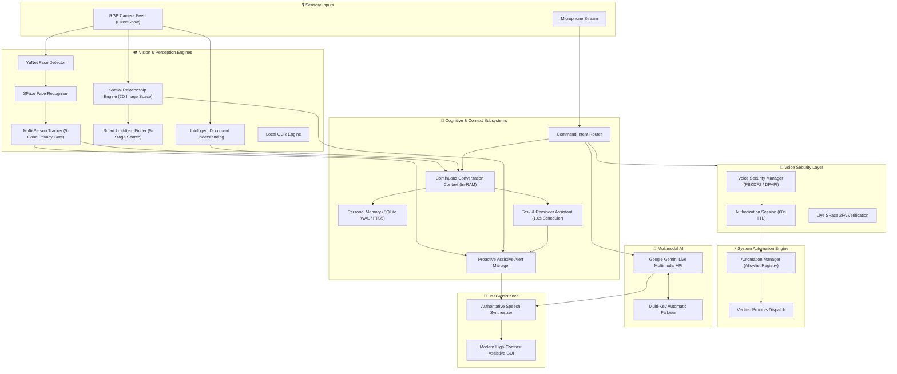

<div align="center">

# 🧊 SG CUBE 2.5

### *Windows Voice-First Personal AI & Assistive AI System*

<p align="center">

**See. Understand. Remember. Assist.**

</p>

<p align="center">
A Windows voice-first Personal AI and Assistive AI system that combines natural voice interaction, computer automation, real-time camera/vision assistance, screen understanding, security controls, and system-level actions.
</p>

<br>

[](https://www.python.org/)
[](https://ai.google.dev/)
[](https://opencv.org/)
[](https://www.sqlite.org/)
[](https://www.microsoft.com/windows)
[](tests/)
[](LICENSE)

<br>

**Voice Security • Personal Memory • Scene Understanding • Lost-Item Finder • Tasks & Reminders • Continuous Context • Multi-Person Awareness • Document Understanding • Safe Automation • Proactive Alerts**

<br>

[✨ Overview](#-overview) •
[🤖 Capabilities](#-sg-cube--personal-ai) •
[📱 Applications](#-applications) •
[⚡ Advantages](#-advantages) •
[⚠️ Limitations](#-limitations) •
[🔄 Sleep & Wake](#-sleep-and-wake-lifecycle) •
[🛡️ Privacy & Security](#️-privacy--security-architecture) •
[🏗️ Architecture](#️-system-architecture) •
[🚀 Installation](#-installation) •
[🧪 Verification](#-testing--verification) •
[👥 Team](#-team--authors) •
[📜 License](#-license)

</div>

---

# 🌌 Overview

**SG CUBE 2.5** is an intelligent, real-time multimodal AI vision companion and assistive system designed for **accessibility, blind and low-vision autonomy, hands-free productivity, privacy, and safety**.

The system unifies real-time computer vision, continuous contextual conversation, explicit personal memory, environmental scene analysis, document understanding, and permission-based Windows system automation into a single cohesive assistant that can be operated entirely by voice or visually through a modern interface.

---

# 🤖 SG CUBE – Personal AI

SG CUBE is a Windows voice-first Personal AI and Assistive AI system that combines natural voice interaction, computer automation, real-time camera/vision assistance, screen understanding, security controls, and system-level actions.

### 🌟 Major Capabilities
* **Wake-Word Activation:** Low-power wake detection on `"SG CUBE"` or `"Hey SG CUBE"`.
* **Continuous Voice Conversation:** Context-aware multi-turn dialogue with natural turn-taking.
* **Gemini Live Integration:** Low-latency multimodal reasoning over voice, images, and camera frames.
* **Windows System Automation:** Allowlisted application control, process dispatch, and window focus management.
* **Mouse and Keyboard Control:** Precise voice-guided cursor positioning, click actions, and keystroke dispatch.
* **Application Launching:** Safe launching and closing of desktop tools (Calculator, Notepad, Browser, Explorer).
* **Notepad Interaction:** Opening, reading, appending, typing, and editing text inside Notepad hands-free.
* **Settings / Wi-Fi / Bluetooth Control:** Checking network statuses and navigating system settings menus.
* **Volume / Brightness Control:** Adjusting audio playback volume and display brightness levels.
* **Web Search / YouTube:** Spoken search querying and instant YouTube video playback.
* **Screenshot and Screen Understanding:** Live screen capture analysis to inspect what is currently displayed.
* **Camera-Based Vision:** Real-time monocular DirectShow video capture and assistive stream processing.
* **Face Detection and Recognition:** Deep neural face detection (OpenCV YuNet) and feature embedding (SFace).
* **Object / Vision Assistance:** Identifying objects, reading spatial positions, and tracking visual sightings.
* **Color Recognition:** Identifying dominant colors of objects held up to the camera.
* **Optical Character Recognition (OCR):** Local document boundary detection, perspective alignment, and reading.
* **Spatial / Safety Awareness:** 2D image-space geometric reasoning and proximity alerts for nearby obstacles.
* **Personal Memory:** Persistent, structured memory storage (`location`, `preference`, `routine`) with FTS5 keyword retrieval.
* **Tasks & Alarms:** Natural language scheduling, recurring reminders, and background notification dispatch.
* **Secure Vault:** Salted PBKDF2-HMAC-SHA256 password vault with DPAPI hardware-bound storage.
* **Voice Authentication:** Multi-tier authorization policy with optional face recognition 2FA for protected commands.
* **Sleep / Wake Lifecycle:** In-process dormant standby mode with single-instance IPC coordination.
* **Single-Instance Protection:** Mutex and socket port guards preventing duplicate instances or conflicting audio devices.

---

# 📱 Applications

1. **Personal AI Assistant**
   Acts as a hands-free desktop companion for setting reminders, managing personal notes, conducting web searches, launching applications, controlling media, and retrieving information through natural conversation.

2. **Assistive Technology for Visually Impaired Users**
   Empowers blind and low-vision individuals with live auditory scene descriptions, real-time obstacle notices, document and receipt reading, color recognition, and lost-object locating.

3. **Hands-Free Computer Control**
   Enables users with motor impairments or those working in hands-busy environments to execute Windows system actions, type notes, manage audio volume, and navigate desktop workflows entirely using voice.

4. **Smart Security and Authentication**
   Protects sensitive commands, credentials, and memory records using spoken passphrases paired with biometric facial verification.

5. **Real-Time Environment and Screen Assistance**
   Bridges physical and digital domains by allowing users to ask questions simultaneously about what is in front of their webcam and what is currently rendered on their computer screen.

---

# ⚡ Advantages

1. **Dual-Mode Assistance**
   Seamlessly integrates digital desktop management with physical world camera assistance in a unified runtime.

2. **Voice-First Interaction**
   Built from the ground up for hands-free operation with natural wake-word detection, continuous speech recognition, and proactive voice responses.

3. **Real-Time Vision Assistance**
   Combines ultra-fast local neural models (YuNet and SFace) for instant detection with cloud multimodal models for deep semantic reasoning.

4. **Local + Cloud Intelligence**
   Stores sensitive personal memories, face models, and credentials locally in encrypted databases while leveraging Google Gemini Live for complex reasoning.

5. **Security-Focused Automation**
   Enforces a strict allowlist policy, deny-by-default execution boundaries, and hardware-bound encryption to prevent unintended system actions.

---

# ⚠️ Limitations

1. **Internet Dependency for Cloud AI Features**
   Google Gemini Live reasoning and cloud multimodal queries require an active internet connection. Basic offline fallback handles local rule-based commands.

2. **Windows 10/11 Platform Dependency**
   The application leverages Windows APIs (DirectShow, DPAPI, Win32 GUI, WASAPI) and is designed specifically for 64-bit Windows environments.

3. **Limited Regional-Language Support**
   While English is fully supported, regional-language support (such as Kannada and Hindi) is currently experimental with limited phonetic dictionaries and vocabulary.

4. **Hardware Performance Dependency**
   Accuracy and latency depend on the user's physical microphone clarity, monocular camera resolution/framerate, and host CPU/GPU capabilities.

5. **Environmental Variability**
   Speech recognition, optical character recognition, and vision detection accuracy may degrade under poor lighting conditions, high acoustic background noise, or extreme camera angles.

---

# 🔄 Sleep and Wake Lifecycle

SG CUBE can enter a dormant sleep state without terminating the main application process, allowing instantaneous wake-up while conserving system resources.

```
Wake / Listening
      ↓
"Go to Sleep"
      ↓
GUI Hidden / Minimized
      ↓
Camera & AI Resources Released
      ↓
Wake Listener Remains Active on Port 49153
      ↓
"SG CUBE" Detected
      ↓
IPC Wake Signal to Port 49152
      ↓
GUI Restored
      ↓
Camera, AI & Microphone Re-initialized
      ↓
LISTENING
```

### Key Lifecycle Guarantees:
* **In-Process Standby:** The main GUI process remains alive in a lightweight dormant state, keeping IPC port `49152` bound to accept immediate wake commands.
* **Hardware Resource Deallocation:** Monocular camera capture streams and Gemini Live WebSocket connections are cleanly closed during sleep to eliminate CPU, GPU, and bandwidth overhead.
* **Single-Instance IPC Coordination:** Dedicated socket locks ensure that duplicate application instances cannot start simultaneously.
* **Audio Ownership Protection:** A transition guard prevents the background wake listener from reopening its microphone stream prematurely while the main application is reinitializing its audio pipeline.

---

# 🛡️ Privacy & Security Architecture

SG CUBE is built with uncompromising user privacy and data security principles:

1. **Local-First Processing:** Computer vision models (YuNet face detection, SFace face recognition, OpenCV spatial engine) execute 100% locally on your machine.
2. **5-Condition Face Privacy Gate:** Unverified or unconfirmed faces are never identified by name; the system safely refers to them as *"a person"*.
3. **Transient In-RAM Context:** Multi-turn conversation context, recent sightings, and proactive queues reside strictly in volatile RAM and automatically expire via time-to-live (TTL) pruning.
4. **Document PII Protection:** High-risk identifiers (payment cards, Aadhaar, PAN, credentials) are automatically scrubbed and redacted before output.
5. **Deny-by-Default System Automation:** System automation is restricted to a curated allowlist with strict input sanitization; arbitrary command execution is completely blocked.
6. **Hardware-Bound Credential Encryption:** Gemini API keys and sensitive settings are secured using Windows DPAPI encryption bound to your user profile.

---

# 🏗️ System Architecture


```mermaid
graph TD
    subgraph SENSORS["🎙️ Sensory Inputs"]
        MIC["Microphone Stream"]
        CAM["RGB Camera Feed (DirectShow)"]
    end

    subgraph SECURITY["🔐 Voice Security Layer"]
        VSEC["Voice Security Manager (PBKDF2 / DPAPI)"]
        AUTH["Authorization Session (60s TTL)"]
        FACE2FA["Live SFace 2FA Verification"]
    end

    subgraph PERCEPTION["👁️ Vision & Perception Engines"]
        YUNET["YuNet Face Detector"]
        SFACE["SFace Face Recognizer"]
        MPT["Multi-Person Tracker (5-Cond Privacy Gate)"]
        SPATIAL["Spatial Relationship Engine (2D Image Space)"]
        FINDER["Smart Lost-Item Finder (5-Stage Search)"]
        DOC["Intelligent Document Understanding"]
        OCR["Local OCR Engine"]
    end

    subgraph CONTEXT["💬 Cognitive & Context Subsystems"]
        ROUTER["Command Intent Router"]
        CTX["Continuous Conversation Context (In-RAM)"]
        MEM["Personal Memory (SQLite WAL / FTS5)"]
        TASKS["Task & Reminder Assistant (1.0s Scheduler)"]
        ALERTS["Proactive Assistive Alert Manager"]
    end

    subgraph AUTOMATION["⚡ System Automation Engine"]
        AUTO["Automation Manager (Allowlist Registry)"]
        EXEC["Verified Process Dispatch"]
    end

    subgraph LLM["🤖 Multimodal AI"]
        GEMINI["Google Gemini Live Multimodal API"]
        FAILOVER["Multi-Key Automatic Failover"]
    end

    subgraph OUTPUT["🤝 User Assistance"]
        TTS["Authoritative Speech Synthesizer"]
        GUI["Modern High-Contrast Assistive GUI"]
    end

    MIC --> ROUTER
    CAM --> YUNET
    CAM --> SPATIAL
    CAM --> DOC

    YUNET --> SFACE
    SFACE --> MPT
    MPT --> CTX
    MPT --> ALERTS

    SPATIAL --> FINDER
    SPATIAL --> ALERTS
    DOC --> CTX

    ROUTER --> SECURITY
    SECURITY --> AUTH
    AUTH --> AUTO
    AUTO --> EXEC

    ROUTER --> CTX
    CTX --> MEM
    CTX --> TASKS
    TASKS --> ALERTS

    ALERTS --> TTS
    ROUTER --> GEMINI
    GEMINI <--> FAILOVER
    GEMINI --> TTS
    TTS --> GUI
```

---

# 🚀 Installation

### Prerequisites
* **Operating System:** Windows 10 or Windows 11 (64-bit)
* **Python Runtime:** Python 3.10, 3.11, 3.12, or 3.13
* **Hardware:** Standard USB/integrated RGB webcam, microphone, speakers/headphones
* **Internet Connection:** Required for Google Gemini Live multimodal reasoning

### 1️⃣ Clone the Repository
```bash
git clone https://github.com/sharathgowdaur-jpg/SG-CUBE-Camera-Model.git
cd SG-CUBE-Camera-Model
```

### 2️⃣ Deploy via Official Windows Installer
Run the automated installer to set up the environment and desktop shortcuts:
```cmd
Install-SG-CUBE.bat
```

Or configure a local virtual environment manually:
```powershell
python -m venv .venv
.venv\Scripts\activate
pip install -r requirements.txt
```

### 3️⃣ Configure Gemini API Keys
Create a `.env` file in the root directory (or use in-app settings):
```env
GEMINI_API_KEY_1=your_primary_api_key
GEMINI_API_KEY_2=your_secondary_api_key_optional
GEMINI_API_KEY_3=your_tertiary_api_key_optional
```

### 4️⃣ Launch SG CUBE
```cmd
run.bat
```
*(Or say **"SG CUBE"** if the background wake listener is active).*

---

# 🧪 Testing & Verification

The core application subsystems and lifecycle routines are rigorously tested using automated unit and integration suites alongside real-world hardware verification.

### Target Regression & Hardware Verification Highlights
* **Targeted Regression Suite:** **44 / 44 tests passed** across sleep/wake lifecycle, wake IPC handoff, background listener lifecycle, camera service, single-instance mutex, greetings, and protected response routing.
* **Physical Microphone Acceptance:** Tested with real WASAPI input hardware verifying PCM capture streams, speech recognition input, and RMS level stability.
* **Physical Camera Acceptance:** Verified DirectShow device index initialization, frame capture integrity, and YuNet/SFace neural pipeline execution.
* **Sleep/Wake Cycles:** 3 complete end-to-end sleep and wake cycles passed consecutively with full state transitions (`LISTENING` ➔ `SLEEPING` ➔ `LISTENING`).
* **Resource Restoration:** Camera and Gemini Live AI services reliably restart upon waking.
* **Audio Arbitrator Handoff:** Microphone ownership handoff validated between background listener and main GUI with zero contention.
* **Single-Instance Integrity:** Verified socket lock enforcement on IPC ports `49152`, `49153`, and `49154`.
* **Zero Audio Duplication:** Speech synthesis queues and audio channels confirmed collision-free.

To run the targeted lifecycle and hardware regression tests:
```bash
pytest tests/test_sleep_wake_lifecycle.py tests/test_wake_ipc_handoff.py tests/test_background_listener_lifecycle_master.py tests/test_camera_service.py tests/test_single_instance.py tests/test_sleep_wake_greetings.py tests/test_protected_response_routing.py -v
```

---

# 📌 Project Information

| Property | Details |
| :--- | :--- |
| **Project** | **SG CUBE** |
| **Version** | **2.5.0** |
| **Release Status** | **Production Release** |
| **Platform** | Windows 10 / 11 (64-bit) |
| **Primary Language** | Python 3.10+ |
| **AI Vision & Multimodal Engine** | Google Gemini Live + Assistive Perception Suite |
| **Local Neural Models** | OpenCV YuNet (Face Detection) + SFace (Face Recognition) |
| **Database Architecture** | SQLite 3 with Write-Ahead Logging (WAL) & FTS5 |
| **License** | MIT License |

---

# 👥 Team & Authors

### 🚀 Founder & Lead Architect
* **Sharath Gowda U R** ([@sharathgowdaur-jpg](https://github.com/sharathgowdaur-jpg)) — Core System Architecture, Vision AI, Deep Neural Face Engine, Full-Stack Engineering

### 🤝 Contributors
* **Gajanand V Dhayagode** ([@gajanand27-05](https://github.com/gajanand27-05)) — Windows DPAPI hardware-bound security enhancements and dependencies hardening

### 🤝 Team Support & Acknowledgments
Special thanks to our teammates and collaborators for their valuable suggestions, ideas, feedback, testing support, and encouragement throughout the development of SG CUBE:
* **Ganesh Bukka** ([@Ganu39](https://github.com/Ganu39)) — Provided valuable suggestions, ideas, feedback, and testing support.
* **Gangadhara C** ([@gangadharac](https://github.com/gangadharac)) — Provided valuable suggestions, ideas, feedback, and overall project support.

---

# 📜 License

SG CUBE is distributed under the open-source **MIT License**. See the [`LICENSE`](LICENSE) file for complete details.

<div align="center">

<br>

### **See. Understand. Remember. Assist.**
**SG CUBE 2.5 — Built with ❤️ for accessible, private, and intelligent AI autonomy.**

</div>
