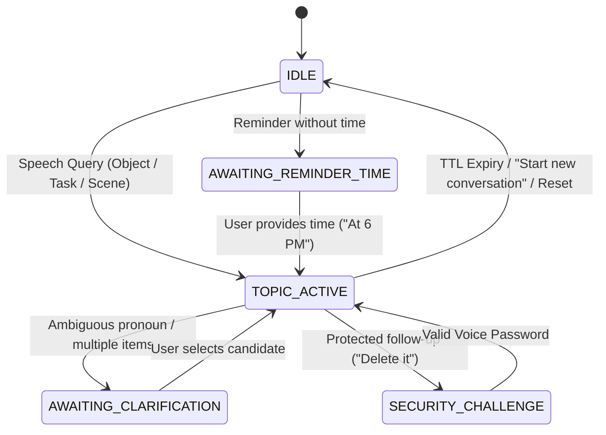

# SG CUBE 2.5 — Continuous Conversation Context Architecture Specification

## Overview

The **Continuous Conversation Context Manager** (`ConversationContextManager`) is a native, local-first conversational context engine for SG CUBE 2.5. It enables natural multi-turn conversations and follow-up commands without requiring users to repeat object names, reminder titles, or task details. Operating entirely in transient memory (RAM) with zero external database or cloud dependencies (no Redis, Vector DB, Pinecone, or Chroma), it delivers deterministic reference resolution, strict priority matching, automatic disambiguation, TTL-based stale context pruning, and full voice security inheritance.

---

## Key Capabilities

1. **Deterministic Pronoun & Reference Resolution**:
   - Resolves *"it"*, *"that"*, *"this"*, *"them"*, *"there"*, *"the other one"*, *"the previous one"*, *"that task"*, *"this reminder"*.
   - Replaces pronouns with concrete entity names before executing perception, spatial, memory, or task handlers.

2. **Strict Priority Reference Resolution Hierarchy**:
   - **Priority 1: Active Pending Clarification / Operation** (e.g. user specifying time for a pending reminder).
   - **Priority 2: Last Explicit Topic Entity** (most recently focused object, task, reminder, or scene surface).
   - **Priority 3: Current Live Scene Entity** (object currently detected in live camera frame).
   - **Priority 4: Recent Turn Entities** (entities mentioned in previous 1-2 turns).
   - **Priority 5: Long-Term Memory** (unambiguous saved personal/location facts).
   - **Priority 6: Disambiguation / Clarification Question** (when multiple candidates exist, SG CUBE asks a single concise question instead of guessing).

3. **Disambiguation Without Hallucination**:
   - If two or more candidate entities exist (*"bottle"* and *"phone"*), SG CUBE asks: *"Do you mean the bottle or the phone?"*
   - Never guesses, hallucinates, or defaults arbitrarily.
   - User response (*"The bottle"*) seamlessly resolves the ambiguity and executes the original intent.

4. **Multi-Turn Conversational Workflows**:
   - **Object Search & Follow-ups**:
     - Turn 1: *"Where is my phone?"* $\to$ *"Your phone is on the table."*
     - Turn 2: *"Where is it?"* $\to$ *"Your phone is on the table."*
     - Turn 3: *"What is next to it?"* $\to$ *"The laptop is next to your phone."*
     - Turn 4: *"What color is it?"* $\to$ *"Your phone is black."*
     - Turn 5: *"Where was it last seen?"* $\to$ *"Your phone was last seen on the desk at 10:15 AM."*
   - **Reminder Creation & Edit Follow-ups**:
     - Turn 1: *"Remind me to submit my report tomorrow."* $\to$ *"When would you like me to set the reminder for submit my report?"*
     - Turn 2: *"At 6 PM."* $\to$ *"Set a reminder to Submit my report for tomorrow at 6:00 PM."*
     - Turn 3: *"Make it 7 PM."* $\to$ *"The reminder has been changed to 7:00 PM."*
     - Turn 4: *"Cancel it."* $\to$ *"Cancelled reminder 'Submit my report'."*
   - **Task Management Follow-ups**:
     - Turn 1: *"Create a task to buy groceries."* $\to$ *"Created task 'Buy groceries'."*
     - Turn 2: *"Mark it as complete."* $\to$ *"Marked task 'Buy groceries' as complete."*
     - Turn 3: *"Delete that task."* $\to$ *"Deleted task 'Buy groceries'."*

5. **Explicit Conversation State Machine**:
   - States: `IDLE`, `TOPIC_ACTIVE`, `AWAITING_CLARIFICATION`, `AWAITING_TASK_DETAIL`, `AWAITING_REMINDER_TIME`, `AWAITING_CONFIRMATION`, `SECURITY_CHALLENGE`.
   - Topics: `GENERAL`, `OBJECT_SEARCH`, `SCENE_UNDERSTANDING`, `TASK_MANAGEMENT`, `REMINDER_MANAGEMENT`, `PERSONAL_MEMORY`, `FACE_RECOGNITION`.

6. **Strict TTL-Based Expiration**:
   - **Semantic Turn TTL**: 10 minutes (`600s`).
   - **Active Object TTL**: 2 minutes (`120s`).
   - **Active Scene TTL**: 1 minute (`60s`).
   - **Active Reminder TTL**: 5 minutes (`300s`).
   - **Active Task TTL**: 10 minutes (`600s`).
   - **Pending Clarification TTL**: 5 minutes (`300s`).
   - **Bounded FIFO Capacity**: Maximum 10 turns. Old turns automatically evict on capacity or TTL expiry.
   - When context expires, references evaluate to `None` and SG CUBE asks for clarification rather than hallucinating stale references.

7. **Strict Isolation & Transient RAM Design**:
   - Conversation context exists solely in thread-safe in-memory data structures.
   - Adding conversation turns **never** writes rows to SQLite (`MemoryManager`, `TaskManager`, or `FaceMemory`).
   - Voice command *"Start a new conversation"* or `[Clear Context]` button in the HUD resets in-memory context to `IDLE` with zero data loss to persistent SQLite databases.

8. **Voice Security & Privacy Inheritance**:
   - Automatic credential redaction: Passwords, phrase secrets, API keys, and credit card numbers are scrubbed from turn text before storing in memory.
   - Follow-up commands inherit central security levels (e.g. deleting a task via *"Delete that task"* is recognized as `TASK_DELETE` and triggers the Voice Security Password challenge if unauthorized).

---

## Data Structures & State Machine

### Data Classes

- **`SemanticTurn`**: Bounded turn record storing `turn_id`, `timestamp`, `user_text` (redacted), `assistant_text` (redacted), `intent`, `topic`, `entities_mentioned`.
- **`ActiveObjectRef`**: Name, category, location description, bounding box, attributes, timestamp.
- **`ActiveTaskRef`**: Task ID, title, priority, status, due timestamp, timestamp.
- **`ActiveReminderRef`**: Reminder ID, title, due timestamp, recurrence, `is_pending_clarification`, `pending_date`, timestamp.
- **`ActiveSceneRef`**: Surface name, object names, summary, timestamp.
- **`PendingClarification`**: Clarification type, prompt text, candidate entities, origin intent, origin params, timestamp.

---

## Voice Command Grammar & Context Reset

| Intent | Sample Voice Query | Context Behavior |
| :--- | :--- | :--- |
| `CONTEXT_RESET` | *"Start a new conversation"*, *"Clear context"*, *"Reset conversation"* | Clears in-memory RAM context, resets state to `IDLE`. |
| `FOLLOWUP_REMINDER_EDIT` | *"Make it 7 PM"*, *"Change that reminder to tomorrow at 8"* | Resolves active reminder ID and modifies due timestamp. |
| `FOLLOWUP_TIME_SPECIFICATION` | *"At 6 PM"*, *"Tomorrow morning"*, *"In 30 minutes"* | Fulfills pending `AWAITING_REMINDER_TIME` state and creates reminder. |
| `OBJECT_SEARCH` (Follow-up) | *"Where is it?"*, *"Where was it last seen?"* | Resolves pronoun to active object and performs search / last seen. |
| `SCENE_QUERY_NEAR` (Follow-up) | *"What is next to it?"*, *"What is near that?"* | Resolves pronoun to active object and queries spatial relations. |
| `TASK_COMPLETE` (Follow-up) | *"Mark it as complete"*, *"Finish that task"* | Resolves active task and marks status `COMPLETED`. |
| `TASK_DELETE` (Follow-up) | *"Delete that task"*, *"Remove it"* | Resolves active task and routes to protected deletion. |

---

## Performance Benchmark

Measured over 1,000 continuous iterations on Windows runtime:

| Operation | Average Latency | p95 Latency | Target Limit | Status |
| :--- | :--- | :--- | :--- | :--- |
| **Turn Context Update** | 7.83 µs | 12.50 µs | < 50 µs | **PASS** |
| **Reference Resolution** | 4.03 µs | 4.40 µs | < 100 µs | **PASS** |
| **Follow-up Intent Resolution** | 6.09 µs | 9.61 µs | < 100 µs | **PASS** |
| **Stale Context Pruning** | 0.81 µs | 0.80 µs | < 20 µs | **PASS** |
| **Context Reset** | 0.51 µs | 0.60 µs | < 10 µs | **PASS** |

---

## Thread Safety & Shutdown

1. `ConversationContextManager` uses reentrant locks (`threading.Lock`) around all turn additions, reference resolutions, pruning, and resets.
2. `VisionEngine` automatically resets transient context during clean shutdown or restart, ensuring fresh state without persistent leaks.
