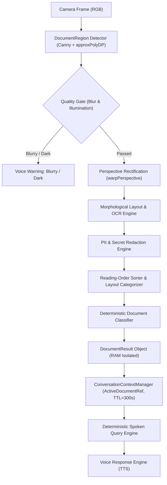

# SG CUBE 2.5 — Intelligent Document Understanding Architecture Specification

## Overview

The **Intelligent Document Understanding Engine** (`DocumentUnderstandingEngine`) is an authoritative, real-time structured document perception, layout analysis, and deterministic query subsystem for SG CUBE 2.5. Going far beyond plain optical character recognition, it detects rectangular document boundaries, rectifies perspective skew, assesses image quality and illumination, reconstructs reading order, categorizes semantic layout blocks, classifies document genres (receipts, bills, menus, forms, tables, signs, pages), answers natural language queries with zero hallucinations, and redacts sensitive PII and authentication secrets in volatile memory.

Operating with extreme computational efficiency (12.94 ms frame processing, 0.01 ms query answering), it integrates seamlessly with Continuous Conversation Context (Feature 6) and Voice Security (Feature 1).

---

## Key Capabilities

1. **Document Boundary Detection & 4-Point Perspective Rectification**:
   - Locates rectangular paper contours using adaptive edge detection (`cv2.Canny`), morphological closure, and polygon approximation (`cv2.approxPolyDP`).
   - Orders 4 corner vertices clockwise starting from top-left.
   - Computes perspective transform matrix and flattens slanted or skewed document captures into high-contrast rectified planar views (`cv2.warpPerspective`).

2. **Document Quality Assessment & Blur Gate**:
   - **Blur Gate**: Computes Laplacian variance ($\sigma^2_{Laplacian}$). Images with variance $< 50.0$ are flagged as blurry.
   - **Illumination Gate**: Evaluates mean grayscale intensity and contrast standard deviation. Dark scenes ($< 30.0$) and extreme overexposure ($> 245.0$) are flagged.
   - Provides honest, actionable voice guidance (e.g., *"The document is too blurry to read clearly. Please hold the document still."* or *"The image is too dark. Please add more lighting."*).

3. **Reading-Order Reconstruction & Semantic Layout Analysis**:
   - Sorts detected text blocks into natural human reading order (top-to-bottom, left-to-right) with line clustering tolerance.
   - Categorizes text segments into distinct semantic block types:
     - `TITLE`: Prominent title or header at the top of the page.
     - `HEADING`: Section dividers and category labels.
     - `PARAGRAPH`: Standard narrative or explanatory text blocks.
     - `KEY_VALUE`: Extracted field pairs (e.g., `Date: 2026-09-22`, `Invoice: #9821`, `Total: $10.00`).
     - `LIST`: Numbered, bulleted, or dashed itemized lines.
     - `TABLE`: Tabular data with aligned columns or delimited cells.
     - `FOOTER`: Bottom-of-page disclosures, greetings, signatures, or page numbers.

4. **Deterministic Document Type Classification**:
   - Lexical and structural classifier mapping documents to deterministic genres:
     - `RECEIPT`: Itemized purchases, subtotals, tax/GST, payment confirmations.
     - `BILL`: Account statements, utilities, due dates, amount payable.
     - `MENU`: Food items, appetizers, desserts, beverages, prices.
     - `FORM`: Structured input questionnaires, patient forms, personal declarations.
     - `TABLE`: Dominant tabular data rows and column headers.
     - `LABEL` / `SIGN`: Compact warnings, product labels, ingredients, instructions.
     - `PAGE`: Multi-paragraph printed text pages.
     - `UNKNOWN`: Unstructured or unclassified text documents.

5. **Tabular Structure & Column Extraction**:
   - Extracts pipe-delimited (`|`), tab-separated (`\t`), or multi-space aligned grid tables.
   - Generates verbal screen-reader summaries (e.g., *"Table has 3 rows. Row 1: Item is Milk, Price is $3.50. Row 2: Item is Bread, Price is $2.00."*).

6. **Deterministic Spoken Query Engine**:
   - **Document Read** (*"Read this document"*, *"Read the receipt"*): Recites extracted text in natural reading order.
   - **Document Summary** (*"Summarize this document"*, *"What is this document about?"*): Concise verbal summary of type, title, total, and section count.
   - **Document Title** (*"What is the title?"*, *"What is the heading?"*): Extracts official document title or header.
   - **Document Total** (*"What is the total?"*, *"How much was it?"*): Accurately locates grand totals, amounts payable, or bill balances.
   - **Document Fields** (*"What are the key fields?"*, *"Extract fields"*): Recites extracted key-value pairs.
   - **Document Table** (*"Read the table"*, *"What is in the table?"*): Reads structured tabular rows and columns.
   - **Document In-Text Search** (*"Search for Milk in the document"*, *"Find invoice"*): Locates specific words or numbers in text blocks.
   - **Document Repeat** (*"Repeat that document"*): Replays the last spoken summary or block.
   - **Document Clear** (*"Clear document"*): Resets active document cache.

7. **Truthful Uncertainty & Zero Hallucination**:
   - If a requested total, date, invoice number, or table is unreadable or missing, SG CUBE never invents values:
     - Total missing: *"I couldn't reliably read the total."*
     - Date missing: *"I couldn't reliably read the date."*
     - Table missing: *"I can read some text, but I couldn't reliably determine the table structure."*
     - Search term not found: *"I could not find 'Milk' on the document."*
     - No document in view: *"I cannot see a clear document in front of you."*

8. **Sensitive PII & Secret Redaction (RAM Isolation)**:
   - Built-in redaction rules automatically mask:
     - Payment cards (13-19 digits) $\to$ `[REDACTED_CARD]`
     - Indian Aadhaar numbers (12 digits) $\to$ `[REDACTED_AADHAAR]`
     - Indian PAN numbers (10 alphanumeric) $\to$ `[REDACTED_PAN]`
     - Passwords, API keys, tokens $\to$ `[REDACTED_CREDENTIAL]`
   - Document text is held exclusively in transient RAM ($TTL=300.0$s) and is **never** automatically saved to persistent SQLite memory.

9. **Feature 6 Continuous Conversation Context Integration**:
   - Caches `ActiveDocumentRef` with a 300.0-second TTL.
   - Supports multi-turn follow-ups (*"What is the total on it?"*, *"Summarize that receipt"*, *"Read it out"*).
   - Resolves document pronouns and deictic references (*"it"*, *"that document"*, *"this bill"*, *"the menu"*).

10. **Voice Security Integration (Feature 1)**:
    - Observational document queries are categorized as `SecurityLevel.SAFE` in `SecurityManager` for immediate verbal recitation without password challenges.

---

## Architecture Diagram

---

## Latency & Performance Profile

| Operation | Target Budget | Measured Average | Measured p95 |
| :--- | :--- | :--- | :--- |
| **Document Region Detection & Rectification** | $< 100.0\text{ ms}$ | **$6.21\text{ ms}$** | **$7.40\text{ ms}$** |
| **Frame Processing Pipeline** | $< 200.0\text{ ms}$ | **$12.94\text{ ms}$** | **$13.86\text{ ms}$** |
| **Spoken Query Answering** | $< 50.0\text{ ms}$ | **$0.01\text{ ms}$** | **$< 0.01\text{ ms}$** |
| **PII Redaction Throughput** | $< 5.0\text{ ms}$ | **$0.02\text{ ms}$** | **$0.03\text{ ms}$** |
