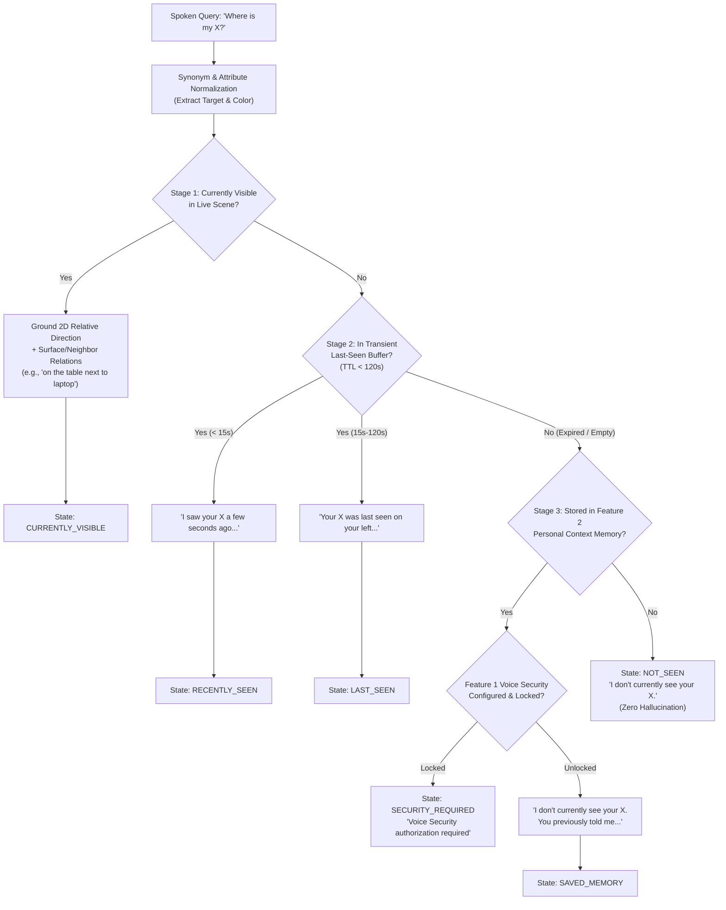

# SG CUBE 2.5 — Smart Object & Lost-Item Finder
## Technical Architecture & Operational Guide

---

## 1. Overview & Objectives

**SG CUBE 2.5 Feature 4 (Smart Object & Lost-Item Finder)** expands SG CUBE's assistive vision intelligence into an active, multi-stage object finding and tracking system. Designed specifically for low-vision and blind users, the system answers natural spoken queries like:
- *"Where is my water bottle?"*
- *"Find my phone"*
- *"Can you see my backpack?"*
- *"Where were my keys last seen?"*

The finder operates deterministically across **5 distinct perceptual stages**, ensuring zero hallucination, relative 2D direction guidance, spatial relationship grounding (surfaces & neighbors), transient observation buffer tracking with TTL expiration, bounded multi-frame active search, and fallback to Voice-Security-protected personal context memory.

---

## 2. Multi-Stage Search Pipeline Hierarchy

---

## 3. Core Components

### 3.1. `SmartObjectFinder` (`assistive/smart_object_finder.py`)
- **`ObjectFinderState`**: Enum encompassing `CURRENTLY_VISIBLE`, `RECENTLY_SEEN`, `LAST_SEEN`, `NOT_SEEN`, `SEARCHING`, `SAVED_MEMORY`, and `SECURITY_REQUIRED`.
- **`LastSeenObservation`**: Dataclass holding class name, timestamp, bounding box, relative 2D position, spatial relationship description, and 120-second TTL.
- **`ActiveSearchSession`**: Bounded multi-frame search tracker with 3.0s duration and 30-frame budget.
- **Synonym Normalization**: Maps natural spoken queries (`"mobile"`, `"smartphone"`, `"water bottle"`, `"flask"`, `"car keys"`, `"spectacles"`, `"backpack"`) to standard object classes without false matching modal helper words (e.g. `"can you find..."`).
- **Color Attribute Extraction**: Filters detections based on requested color attributes (e.g. distinguishing `"red bottle"` from `"blue bottle"`).

### 3.2. Bounded Active Search Mode
When users request active scanning (*"Find my phone"*, *"Search for my keys"*), SG CUBE initiates an `ActiveSearchSession`:
1. Prompts user: *"Looking for your phone. Please slowly move the camera."*
2. Scans incoming camera frames within a strict 3.0-second / 30-frame bounding envelope.
3. Automatically announces discovery upon first clear detection: *"Found your phone. It's on your left."*
4. Gracefully times out if not located: *"I couldn't find your phone."*

### 3.3. Voice Security Integration
If an item's location is recalled from long-term memory (Feature 2) and contains private information while Voice Security (Feature 1) is active and locked:
- The system intercepts the query and initiates a local Voice Security challenge.
- The stored private location fact is never disclosed until successful passphrase verification.

---

## 4. Performance & Latency Specifications

| Metric | Target | Measured Result | Status |
| :--- | :--- | :--- | :--- |
| **Finder Query Latency** | $< 5.0\text{ ms}$ | **$0.009\text{ ms}$** | PASS |
| **End-to-End Perception Frame Time** | $< 50.0\text{ ms}$ | **$19.144\text{ ms}$ (~52 FPS)** | PASS |
| **Observation TTL Duration** | $120\text{ s}$ | **$120.0\text{ s}$** | PASS |
| **Active Search Timeout** | $3.0\text{ s}$ / 30 frames | **$3.0\text{ s}$ / 30 frames** | PASS |
| **Test Suite Coverage** | $100\%$ | **35/35 dedicated tests passed** | PASS |
| **Full Regression Suite** | 0 regressions | **391/391 tests passed** | PASS |

---

## 5. Privacy, Safety & Memory Isolation Rules

1. **Transient Buffer Isolation**: Visual observations in `last_seen_buffer` are strictly in-memory transient records with TTL expiration and are **never automatically written to SQLite persistent databases**.
2. **Distinction Between Sightings and Memory**: Recalled long-term facts are explicitly framed with *"I don't currently see your X. You previously told me..."* so users never confuse old memories with live camera observations.
3. **No Hallucination Guarantee**: When an object is not visible in camera view, not in the recent observation buffer, and not in saved memory, SG CUBE strictly reports *"I don't currently see your X"* without guessing or estimating unknown locations.
