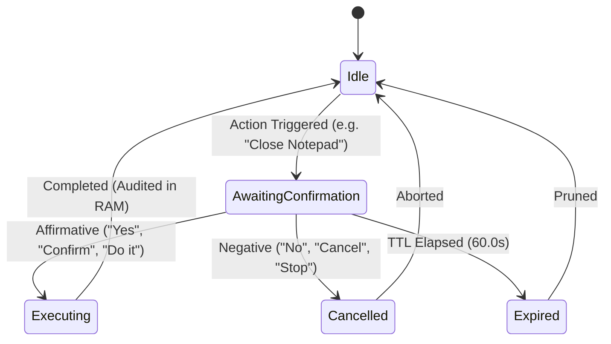

# SG CUBE 2.5 — Permission-Based System Automation Specification

## Overview

The **System Automation Subsystem** (`AutomationManager`) provides an authoritative, deterministic, voice-driven automation framework for SG CUBE 2.5. It enables users to perform safe, essential workstation actions—such as opening approved applications, visiting verified websites, opening user folders, copying text to the clipboard, locking the workstation, and inspecting automation status—strictly governed by fine-grained permissions, risk levels, voice security authorization, and explicit spoken confirmation.

Operating under a strict **Deny-by-Default** and **Zero Arbitrary Execution** security posture, the engine completely eliminates attack vectors such as arbitrary shell execution, PowerShell injection, untrusted binaries, directory traversal, SSRF/loopback network requests, and indirect prompt injection from scanned documents.

---

## Security Philosophy & Threat Model

### 1. Strict Allowlist-Only & Deny-by-Default
- **No Arbitrary Commands**: `shell=True`, `os.system()`, `subprocess.Popen(shell=True)`, `eval()`, `exec()`, `cmd.exe`, and `powershell.exe` are completely forbidden.
- **Allowed Application Registry**: Execution is restricted to pre-registered, vetted executable targets located in verified system or standard program paths (`calc.exe`, `notepad.exe`, `explorer.exe`, `msedge.exe`, `chrome.exe`, `firefox.exe`).
- **Target Parameter Stripping**: Execution launches strictly fixed binaries with no untrusted command-line arguments.

### 2. URL & Web Navigation Safety
- **Scheme Validation**: Strictly allows `http://` and `https://`. Rejects `file://`, `javascript:`, `data:`, `vbscript:`, and custom protocol handlers.
- **Network Isolation**: Blocks localhost, loopback (`127.0.0.1`), private IP subnets (`10.0.0.0/8`, `172.16.0.0/12`, `192.168.0.0/16`), and AWS/cloud metadata services (`169.254.169.254`).
- **Character Filtering**: Strips or rejects control characters, newlines, semicolons (`;`), pipes (`|`), ampersands (`&`), and shell command substitution tokens (`` ` ``, `$`).

### 3. Folder Navigation & Path Traversal Prevention
- **User Folders Only**: Allows access only to predefined user directories: `Documents`, `Downloads`, `Desktop`, `Pictures`, `Music`, `Videos`, and `Home` (`~`).
- **System Path Defense**: Explicitly rejects directory traversal sequences (`..`), root drives (`C:\`), and protected Windows directories (`C:\Windows`, `C:\Program Files`, `C:\ProgramData`).

### 4. Indirect Prompt Injection & OCR Document Isolation
- **Document Source Isolation**: Requests originating from scanned camera documents or OCR captures (`source="document_isolated"`) are immediately blocked from executing system actions with status `BLOCKED_DOCUMENT_ISOLATED`.

---

## Risk Level & Permission Model

Each automation action type is assigned a static default risk level and customizable permission policy:

| Action Type | Default Risk Level | Default Permission | Description |
| :--- | :--- | :--- | :--- |
| `STATUS` | `SAFE` | `ALLOWED` | Queries active automation status and execution history. |
| `OPEN_APP` | `LOW_RISK` | `ALLOWED` | Launches an approved application from the allowlist. |
| `OPEN_URL` | `LOW_RISK` | `ALLOWED` | Opens an approved HTTP/HTTPS website in default browser. |
| `OPEN_FOLDER` | `LOW_RISK` | `ALLOWED` | Opens an approved user directory in File Explorer. |
| `COPY_TEXT` | `LOW_RISK` | `ALLOWED` | Copies text to Windows system clipboard. |
| `CLOSE_APP` | `PROTECTED` | `ASK_EACH_TIME` | Terminates an approved application instance via `taskkill`. |
| `LOCK_WORKSTATION` | `PROTECTED` | `ASK_EACH_TIME` | Locks Windows workstation via direct `user32.LockWorkStation`. |

### Permission States:
- `ALLOWED`: Executes immediately (if not protected or requiring confirmation).
- `ASK_EACH_TIME`: Enforces an explicit spoken confirmation state (`AWAITING_CONFIRMATION`) before dispatching the execution.
- `DENIED`: Automatically rejects the action with a clear spoken denial notice.

---

## Multi-Turn Spoken Confirmation State Machine

When an action requires confirmation (`ASK_EACH_TIME` or `PROTECTED` risk):

1. **State Entry**: The system stores an `AutomationRequest` in `ConversationContextManager.pending_automation` with a 60-second TTL and prompts:
   *"Are you sure you want to close Notepad? Please say yes to confirm or no to cancel."*
2. **Affirmative Resolution**: User replies *"Yes"*, *"Confirm"*, *"Please do"*, or *"Go ahead"*. The action is executed and active context is updated.
3. **Negative Resolution**: User replies *"No"*, *"Cancel"*, or *"Nevermind"*. The action is aborted:
   *"Cancelled closing Notepad."*
4. **Pronoun Resolution (Deixis)**: If an app is opened, subsequent pronoun references (*"Close it"*, *"Shut it"*) resolve to the active application in context.

---

## Voice Security Integration (Feature 1)

For protected and high-risk actions, if Voice Security Password is configured:
1. `SecurityManager` validates whether the session is currently authenticated (`is_authorized()`).
2. If unauthorized, execution is halted with status `DENIED_SECURITY_CHALLENGE`:
   *"Please provide your security password to authorize this action."*
3. Once authenticated via Voice Password or Face 2FA, the pending automation action completes cleanly.

---

## Audit Logging & Privacy

- **In-Memory Ring Buffer**: Records up to 50 recent execution events in RAM (`collections.deque(maxlen=50)`).
- **Zero Sensitive Data Persistence**: Text copied to clipboard is masked in audit logs (e.g. `[REDACTED_TEXT: 24 chars]`).
- **No Disk Leakage**: System automation logs and transient requests are volatile and never written to plain disk storage.

---

## Spoken Command Reference

| Intent | Example Utterances | Spoken Feedback |
| :--- | :--- | :--- |
| **Open App** | *"Open calculator"*, *"Launch Notepad"*, *"Open browser"* | *"Opening Calculator."* |
| **Close App** | *"Close calculator"*, *"Quit Notepad"*, *"Close it"* | *"Are you sure you want to close Calculator? Please say yes to confirm or no to cancel."* $\to$ *"Closed Calculator."* |
| **Open Website** | *"Open website https://google.com"*, *"Go to github.com"* | *"Opening https://google.com."* |
| **Open Folder** | *"Open Documents"*, *"Open Downloads folder"*, *"Show Desktop"* | *"Opening Documents folder."* |
| **Copy Text** | *"Copy hello world to clipboard"*, *"Copy this text"* | *"Text copied to clipboard."* |
| **Lock Device** | *"Lock my computer"*, *"Lock workstation"* | *"Are you sure you want to lock the computer? Please say yes to confirm or no to cancel."* $\to$ *"Locking workstation."* |
| **Status** | *"Automation status"*, *"System automation status"* | *"System automation is active. 6 actions permitted, 0 pending."* |
