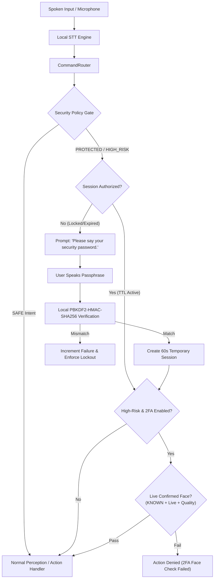

# SG CUBE 2.5 — Voice Security Password & Local Authorization Specification

**Feature Version:** SG CUBE 2.5  
**Baseline Version:** SG CUBE 2.4.7 (Tag: `v2.4.7`, Commit: `657c11a`)  
**Development Branch:** `feature/sg-cube-2.5`  
**Target Platform:** Windows 11 Desktop (x86_64), Python 3.13.9  

---

## 1. System Architecture & Overview

SG CUBE 2.5 introduces a local authorization subsystem designed to safeguard sensitive assistive data, personal long-term memories, face profiles, and system settings behind a user-defined **Voice Security Password**.



---

## 2. Threat Model & Security Principles

### 2.1 Spoken Knowledge Factor vs. Voice Biometrics
The Voice Security Password is fundamentally a **spoken knowledge factor**. It is not speaker identification, voiceprint biometrics, or cryptographic voice matching.
- **Speech Recognition Role:** The local speech-to-text pipeline converts the spoken audio into text tokens.
- **Verification Role:** Verification proves knowledge of the chosen phrase, not physical ownership of the speaker's vocal cords.
- **Explicit Limitation:** Anyone who knows or overhears the spoken password can authorize the system unless secondary factors (e.g. Live Face 2FA) are enforced.

### 2.2 Replay Attack Vulnerability
A static spoken phrase is susceptible to acoustic replay attacks (e.g., recorded audio played through a loudspeaker). SG CUBE 2.5 mitigates this risk for high-risk actions by combining the Voice Security Password with real-time **Confirmed Live Face 2FA** (which actively requires continuous 3D texture gradient motion and landmark confirmation).

### 2.3 Zero LLM Leakage
Security password handling is 100% deterministic and local:
- Raw passphrases are **never** forwarded to Gemini Live or cloud APIs.
- Passphrase challenges are intercepted prior to WebSocket transmission.
- Passphrase utterances are scrubbed and replaced with `[VOICE_PASSWORD_REDACTED]` in console logs, diagnostic outputs, and SQLite conversation history (`conversations.db`).

---

## 3. Cryptographic Storage & Key Derivation

The raw Voice Security Password is not intentionally persisted, logged, sent to Gemini, or stored in conversation history.

```text
Normalized Spoken Phrase ──> PBKDF2-HMAC-SHA256 (100,000 iter, 16-byte salt) ──> DPAPI Encryption ──> security_verifier.dat
```

### Storage Parameters:
- **Algorithm:** PBKDF2-HMAC-SHA256
- **Iteration Count:** 100,000 iterations
- **Salt:** 16 bytes of cryptographically secure pseudo-random bytes (`secrets.token_bytes(16)`)
- **Storage Path:** `%LOCALAPPDATA%\Programs\SG-CUBE\data\user_preferences\security_verifier.dat`
- **File Encryption:** Protected via Windows DPAPI (`CryptProtectData`) tied to the user's logged-in Windows security account.
- **Constant-Time Verification:** Hash comparisons use `hmac.compare_digest` to eliminate side-channel timing attacks.

---

## 4. Centralized Security Policy Matrix

All application commands are centrally categorized into one of three security tiers:

| Tier | Policy Name | Actions & Command Intents | Authorization Requirement |
| :--- | :--- | :--- | :--- |
| **Tier 1** | `SAFE` | General conversation, OCR, Currency, Color, Environment, Object Search, Safety Alerts, Introduction, Face Identification | **None** (Unrestricted execution) |
| **Tier 2** | `PROTECTED` | `MEMORY_RECALL`, `MEMORY_LIST`, `MEMORY_FORGET`, `FACE_LIST`, `FACE_FORGET`, `CONVERSATION_HISTORY_VIEW`, `API_CONFIG_VIEW` | **Voice Security Password** (or Active 60s Session) |
| **Tier 3** | `HIGH_RISK` | `MEMORY_CLEAR` (mass deletion), `FACE_FORGET_ALL` (all profiles), `HISTORY_CLEAR_ALL`, `SECURITY_REMOVE`, `SECURITY_RESET` | **Voice Security Password + Confirmed Live Face (2FA)** |

---

## 5. Security Operations & User Flows

### 5.1 First-Run Onboarding
Upon launching SG CUBE on a fresh installation:
1. SG CUBE checks `security_password_configured`.
2. If unconfigured, the onboarding wizard prompts:
   *"Before using private features, let's create your Voice Security Password. Please say your security password."*
3. The user speaks their phrase $\to$ *"Please repeat your security password."*
4. Upon matching, a one-time **Recovery Code** (e.g. `RC-A7F2-9K4B`) is generated and presented to the user.
5. Persistent configuration state is saved (`security_onboarding_completed = True`), preventing recurring prompts on subsequent startups.

### 5.2 Set Password
- **Voice Trigger:** *"Set my security word"*, *"Set security password"*
- **GUI Trigger:** Settings $\to$ `[Set Password]`
- **Validation:** Normalized text must contain at least 2 words ($\ge 3$ characters).
- **Outcome:** Generates salt + PBKDF2 verifier and issues one-time recovery code.

### 5.3 Change Password
- **Voice Trigger:** *"Change security password"*, *"Update security password"*
- **GUI Trigger:** Settings $\to$ `[Change]`
- **Requirement:** Must supply and verify the **current password** before entering the new password.
- **Outcome:** Invalidates old verifier, commits new verifier, revokes active sessions.

### 5.4 Reset Password (Secure Recovery)
- **GUI Trigger:** Settings $\to$ `[Reset]`
- **Requirement:** Requires entering the valid **one-time Recovery Code** (`RC-XXXX-XXXX`).
- **Outcome:** Verifies recovery code, prompts for new password + confirmation, generates a **new recovery code**, and invalidates the old recovery code.

### 5.5 Remove Password
- **GUI Trigger:** Settings $\to$ `[Remove]`
- **Voice Trigger:** *"Remove security password"*
- **Requirement:** Verifies current password + explicit user confirmation dialog.
- **Safety Guarantee:** Disabling security **does not delete** user memories, face profiles, or conversation history.

### 5.6 Lock Session
- **Voice Trigger:** *"Lock security"*, *"Lock session"*
- **GUI Trigger:** Settings $\to$ `[Lock Now]`
- **Outcome:** Immediately revokes the temporary 60-second authorization session.

---

## 6. Temporary Authorization Session & Lockout Mechanism

### 6.1 Session Lifecycle
- **Default TTL:** 60 seconds of inactivity.
- **Session Extension:** Ongoing voice interactions within the session refresh the inactivity timer.
- **Automatic Expiration:** Once the 60-second window elapses without sensitive commands, the session relocks.

### 6.2 Progressive Lockout on Repeated Failures
To defeat automated brute-force guessing attacks:

| Failed Attempt | Resulting Action | Spoken Response |
| :---: | :--- | :--- |
| **1** | Failed verification | *"Authorization failed. Please try again."* |
| **2** | Failed verification | *"Authorization failed."* |
| **3** | **30-Second Lockout** | *"Too many failed attempts. Security is temporarily locked for 30 seconds."* |
| **4** | **60-Second Lockout** | *"Too many failed attempts. Security is temporarily locked for 60 seconds."* |
| **$\ge$ 5** | **5-Minute (300s) Lockout** | *"Too many failed attempts. Security is temporarily locked for 5 minutes."* |

---

## 7. High-Risk Two-Factor (Voice + Live Face 2FA)

For high-risk actions (`MEMORY_CLEAR`, `FACE_FORGET_ALL`, `SECURITY_REMOVE`), SG CUBE 2.5 enforces multi-factor verification:

1. **Factor 1 (Knowledge):** Valid Voice Security Password.
2. **Factor 2 (Biometric Liveness):** Current camera frame must satisfy all 5 production gates:
   - Match State: `KNOWN`
   - Tracking Tracklet: `is_confirmed == True` (Temporal confirmation $M=3\text{ of }N=5$)
   - Liveness / Anti-Spoof: `liveness_ok == True` (Dynamic 3D gradient motion)
   - Quality Gate: `quality_ok == True` (Sharpness $\ge 45.0$, valid exposure)
   - Enrolled Identity: Name matched in local `face_memory`

If either factor fails, the high-risk action is blocked with an explicit verbal reason.

---

## 8. Privacy & Data Handling Guarantees

```text
+------------------------------+------------------------------------+
| Artifact / Channel           | Plaintext Password Exposure Level  |
+------------------------------+------------------------------------+
| Gemini Live WebSocket Stream | ZERO (Intercepted locally)         |
| SQLite History Database      | ZERO (Masked as [REDACTED])        |
| Persistent SQLite Memories   | ZERO (Never stored in memory)      |
| Console / Stdout Diagnostics | ZERO (Masked as [REDACTED])        |
| Application Logs (log file)  | ZERO (Masked as [REDACTED])        |
| Telemetry & Crash Reports    | ZERO (Omitted)                     |
+------------------------------+------------------------------------+
```

---

## 9. User Instructions & Practical Guide

1. **Setting your Voice Security Password:**
   - Say: *"SG CUBE, set my security word"*
   - When prompted, speak a 3-to-4 word phrase (e.g., *"mango seven river"* or *"blue forest winter"*).
   - Repeat the exact phrase when requested.
   - Note down the generated Recovery Code displayed on screen.
2. **Accessing Private Memories:**
   - Say: *"SG CUBE, show my memories"*
   - When SG CUBE says *"This is a protected action. Please say your security password"*, speak your phrase.
   - Access is granted and your session remains unlocked for 60 seconds.
3. **Locking your Session Immediately:**
   - Say: *"SG CUBE, lock security"*
