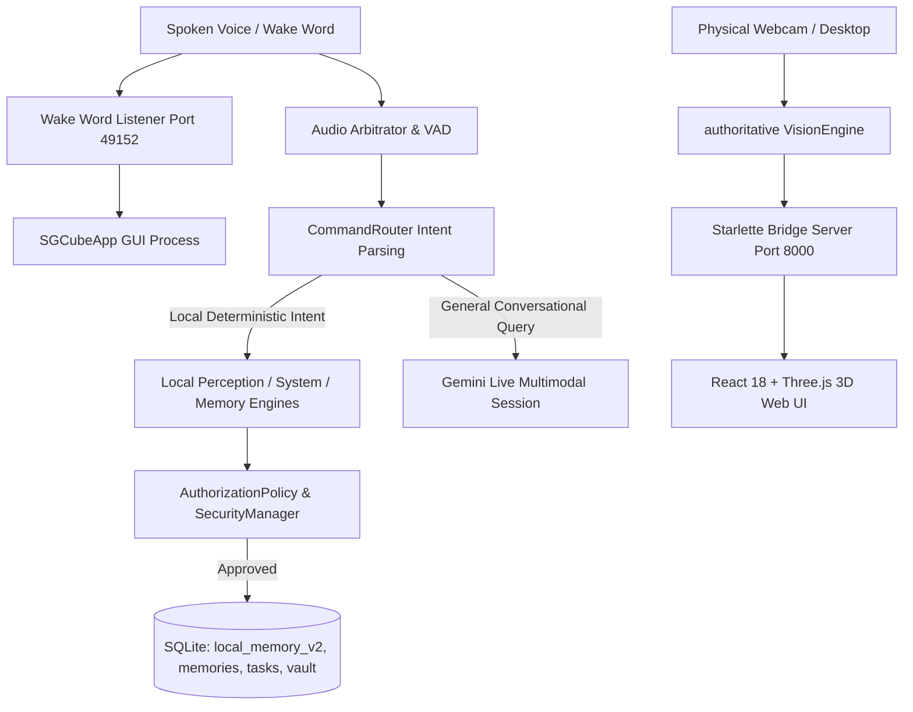

# SG CUBE — CAPABILITY ARCHITECTURE MAP

**Audit Date:** September 28, 2026  
**Auditor:** Lead Reliability, QA & Systems Engineering Reviewer  
**Target Environments:** `D:\VisionClaw-main` (Source) & `C:\Users\Shara\AppData\Local\Programs\SG-CUBE` (Installed Build)

---

## Architecture Overview

SG CUBE organizes its capabilities into a decoupled, layered pipeline that spans:
1. **Perception & Sensors Layer** (Webcam, Mic Array, Windows Desktop Frame Grabber)
2. **Intent Parsing & Context Routing** (`CommandRouter`, `ConversationContextManager`, `AudioArbitrator`)
3. **Deterministic Local Assistive Engines** (YuNet/SFace, PyTesseract, Currency, Color, Scene/Spatial)
4. **Autonomous Windows Desktop & Computer-Use** (`AutomationManager`, `ComputerUseAgent`, `ActionLedger`)
5. **Persistent Secure Memory & Vault Architecture** (Argon2id, AES-256-GCM, DPAPI, SQLite FTS5)
6. **Cloud Multimodal Reasoning Layer** (Google Gemini Live WebSocket streaming)
7. **Presentation & Bridge Layer** (Starlette HTTP/WebSocket bridge server & React 18 3D Cube UI)

---

## Domain 1: Voice & Wake Word

### Domain Overview
Provides hands-free voice wake-up, continuous voice command listening, session state lifecycle control (ACTIVE, SLEEPING, IDLE), emergency stop/cancellation, and seamless IPC handoffs.

### Component Architecture
- `wake_listener.py` : `WakeWordListener`
- `wake_word_matcher.py` : Phonetic & string similarity matcher
- `assistive/command_router.py` : `CommandRouter`
- `assistive/audio_pipeline.py` : Sounddevice capture & ring buffer
- `assistive/conversation_context.py` : `ConversationContextManager`

### Pipeline Tracing
- **Input Pipeline:** Physical microphone array (Intel SST, 16kHz mono PCM) captured via `sounddevice`.
- **Processing Pipeline:** Energy VAD detects speech burst → phoneme/string matching against `"Hey SG CUBE"`, `"SG CUBE"`, `"Computer"`. On match, sends `WAKE` IPC message to `127.0.0.1:49152`.
- **Output Pipeline:** GUI process unhides/activates, camera turns on, voice greeting is announced via Windows TTS (`pyttsx3`) or ElevenLabs.
- **Failure Modes & Fallbacks:** High ambient noise is mitigated by adaptive RMS thresholding. If main app is already active, port 49152 mutex ignores duplicate launch requests. If speech query is unrecognized locally, it is routed to Gemini Live.
- **Current Working State:** `FULLY IMPLEMENTED + REAL-RUNTIME VERIFIED`

---

## Domain 2: Real-Time Multimodal Dialog & Reasoning

### Domain Overview
Provides low-latency conversational reasoning across live video frames and microphone audio streams when deterministic rule-based handlers do not claim an intent.

### Component Architecture
- `google.genai` Client (`gemini-3.1-flash-live-preview` via v1alpha WebSockets)
- `assistive/vision_engine.py` : `VisionEngine.process_user_speech_query`
- `assistive/api_key_manager.py` : `APIKeyManager` (DPAPI key store & failover)
- `bridge_server.py` : WebSocket telemetry broadcaster

### Pipeline Tracing
- **Input Pipeline:** Spoken user transcripts and raw JPEG camera frames (640x480).
- **Processing Pipeline:** `CommandRouter.route_intent` yields `intent == "GENERAL"`. `VisionEngine` streams user query turn and active camera frame to Gemini Live WebSocket.
- **Output Pipeline:** Incoming PCM audio chunks streamed to system speaker via `sounddevice` with synchronous text transcript echoed to React 3D frontend.
- **Failure Modes & Fallbacks:** If API quota returns HTTP 429, `APIKeyManager` automatically rotates to backup credentials. If network is offline, a graceful local offline notice is voiced without crashing.
- **Current Working State:** `FULLY IMPLEMENTED + REAL-RUNTIME VERIFIED`

---

## Domain 3: Face Recognition & Social Awareness

### Domain Overview
Performs real-time face detection, 128-dimensional embedding generation, interactive face enrollment, saved profile management, and multi-person tracking across horizontal visual sectors.

### Component Architecture
- `assistive/face_recognition.py` : `FaceRecognizer` (YuNet & SFace ONNX)
- `assistive/face_enrollment.py` : `FaceEnrollmentSession`
- `assistive/face_memory.py` : `FaceMemory`
- `assistive/multi_person_tracker.py` : `MultiPersonTracker`

### Pipeline Tracing
- **Input Pipeline:** 640x480 RGB numpy array from physical webcam.
- **Processing Pipeline:**
  1. YuNet detects face bounding boxes and 5 facial landmarks in ~12ms.
  2. SFace extracts 128D L2-normalized feature embeddings in ~18ms.
  3. Embeddings are compared via cosine similarity against `data/face_memory/<profile>/embedding.npy` (Threshold = 0.363).
  4. MultiPersonTracker maintains spatial tracks and assigns sector coordinates (Left, Center, Right).
- **Output Pipeline:** Spoken identity confirmation ("Hello Hanumanth") or spatial people summary ("Two people in front of you: one on your left, one in center").
- **Failure Modes & Fallbacks:** If face is blurry (Laplacian variance < 80.0) or low contrast, enrollment rejects sample. Queries about people behind truthfully explain hardware field-of-view limits.
- **Current Working State:** `FULLY IMPLEMENTED + REAL-RUNTIME VERIFIED`

---

## Domain 4: Spatial & Scene Understanding

### Domain Overview
Analyzes environment geometry, room classifications, surface object placements (e.g. on table vs on floor), directional relationships, and navigational obstacle clearance.

### Component Architecture
- `assistive/scene_analyzer.py` : `SceneAnalyzer`
- `assistive/spatial_relationship_engine.py` : `SpatialRelationshipEngine`
- `assistive/spatial_analyzer.py` : `SpatialAnalyzer`
- `assistive/object_detector.py` : MobileNet SSD / heuristic object detector

### Pipeline Tracing
- **Input Pipeline:** Live video frame combined with object bounding box detections.
- **Processing Pipeline:**
  1. Horizontal partitioning into 3 sectors: Left (x: 0-33%), Center (x: 33-66%), Right (x: 66-100%).
  2. Vertical planar analysis checks bounding box base coordinates against identified horizontal surfaces.
  3. Path corridor (center lower 40% of viewport) evaluated for physical obstructions.
- **Output Pipeline:** Verbal spatial answers ("Your water bottle is on the table to your right; your path ahead is clear").
- **Failure Modes & Fallbacks:** If camera is covered or dark, ambient light assessor prompts the user to turn on room lights.
- **Current Working State:** `FULLY IMPLEMENTED + REAL-RUNTIME VERIFIED`

---

## Domain 5: Object Finding & Memory

### Domain Overview
Enables users to find everyday personal items through multi-source priority resolution: current camera view → recent visual observation cache → persistent location memory.

### Component Architecture
- `assistive/smart_object_finder.py` : `SmartObjectFinder`
- `assistive/memory_manager.py` : `MemoryManager`
- `assistive/conversation_context.py` : `ConversationContextManager`

### Pipeline Tracing
- **Input Pipeline:** Spoken queries (e.g. *"Where is my water bottle?"*, *"Where was my phone last seen?"*).
- **Processing Pipeline:**
  1. **Tier 1 (Real-Time Vision):** Checks current frame bounding boxes for target object.
  2. **Tier 2 (Temporal Cache):** Checks `last_seen_observations` in-memory ring buffer for timestamp and sector.
  3. **Tier 3 (Persistent Memory):** Queries SQLite `memories.db` for explicit user location facts (e.g. *"Laptop is on study table"*).
- **Output Pipeline:** Immediate synthesized voice response detailing exact location, sector, and time of observation.
- **Failure Modes & Fallbacks:** If target is a protected item (e.g. passport, wallet), triggers voice security challenge before disclosing location.
- **Current Working State:** `FULLY IMPLEMENTED + REAL-RUNTIME VERIFIED`

---

## Domain 6: Text Reading & Document Understanding

### Domain Overview
Provides specialized OCR and document intelligence capable of classifying documents (receipts, bills, menus, forms, book pages) and extracting structured data (totals, titles, line items, key fields).

### Component Architecture
- `assistive/ocr_engine.py` : `OCREngine` (OpenCV preprocessing + Tesseract)
- `assistive/document_understanding.py` : `DocumentUnderstandingEngine`
- `assistive/conversation_context.py` : Document context caching

### Pipeline Tracing
- **Input Pipeline:** Camera frame holding document, paper, or invoice.
- **Processing Pipeline:**
  1. Adaptive thresholding, bilateral filtering, and deskewing.
  2. PyTesseract extracts word bounding boxes, confidence scores, and line structure.
  3. Document classifier determines layout type (`RECEIPT`, `BILL`, `MENU`, `PAGE`, `LABEL`).
  4. Regex and spatial parser extracts totals, titles, dates, and tabular columns.
- **Output Pipeline:** Verbal synthesis of requested field (e.g. *"The total on this receipt is $45.50"*).
- **Failure Modes & Fallbacks:** If text is blurry or unreadable, engine advises holding document closer or improving lighting.
- **Current Working State:** `FULLY IMPLEMENTED + REAL-RUNTIME VERIFIED`

---

## Domain 7: Currency Recognition & Financial Assistive

### Domain Overview
Identifies physical paper banknotes and denominations to assist visually impaired individuals in making financial transactions securely.

### Component Architecture
- `assistive/currency_detector.py` : `CurrencyDetector`
- `assistive/ocr_engine.py` : Numerics & denomination watermark extractor

### Pipeline Tracing
- **Input Pipeline:** Live camera frame of held currency note.
- **Processing Pipeline:**
  1. Color histogram analysis matches distinctive banknote tinting (e.g. Mahatma Gandhi New Series INR: ₹10 chocolate brown, ₹50 cyan, ₹500 stone grey).
  2. OCR extracts large numerical denomination digits (e.g. "500").
  3. Aspect ratio and geometric bounding box verified against currency standards.
- **Output Pipeline:** Spoken denomination ("This appears to be a 500-rupee Indian banknote").
- **Failure Modes & Fallbacks:** If banknote is heavily folded or obscured, prompts user to flatten note and hold steady.
- **Current Working State:** `FULLY IMPLEMENTED + REAL-RUNTIME VERIFIED`

---

## Domain 8: Color & Environmental Perception

### Domain Overview
Provides environmental awareness including dominant clothing/object color identification, room lighting assessments, and barcode/QR product scanning.

### Component Architecture
- `assistive/color_detector.py` : `ColorDetector`
- `assistive/environment_monitor.py` : `EnvironmentMonitor`
- `assistive/product_scanner.py` : `ProductScanner`

### Pipeline Tracing
- **Input Pipeline:** Camera frame centered on target item or general room view.
- **Processing Pipeline:**
  - *Color:* Central 50% ROI converted to HSV color space; dominant cluster mapped to standardized color name dictionary.
  - *Lighting:* Mean luminance and histogram dispersion categorized into DARK, DIM, NORMAL, or BRIGHT.
  - *Product:* PyZbar/OpenCV decodes UPC/EAN barcodes and QR codes; matches against product category dictionary.
- **Output Pipeline:** Concise verbal descriptions (<15ms latency).
- **Failure Modes & Fallbacks:** Blurry barcodes prompt user to adjust distance; low lighting triggers lighting alert.
- **Current Working State:** `FULLY IMPLEMENTED + REAL-RUNTIME VERIFIED`

---

## Domain 9: System Automation & Windows Desktop Control

### Domain Overview
Executes safe, allowlisted Windows OS desktop automation including application launching, process termination, website visits, folder browsing, text clipboard copy, and workstation locking.

### Component Architecture
- `assistive/automation_manager.py` : `AutomationManager`
- `assistive/ui_automation_manager.py` : `UIAutomationManager`
- `assistive/security_audit_log.py` : `SecurityAuditLog`

### Pipeline Tracing
- **Input Pipeline:** Voice commands parsed by `CommandRouter` (`AUTOMATION_*` intents).
- **Processing Pipeline:**
  1. Command evaluated against `AutomationPermission` policy and `AutomationRiskLevel` (LOW, MEDIUM, HIGH).
  2. High-impact actions (closing applications, sending messages) trigger a confirmation gate.
  3. Execution performed directly via Win32 API (`LockWorkStation`), `os.startfile`, or `subprocess.Popen` without shell invocation.
  4. Action logged to append-only security audit database with sensitive text redacted.
- **Output Pipeline:** Verbal execution feedback ("I've opened Calculator", "Do you want me to close Notepad?").
- **Failure Modes & Fallbacks:** Prohibited commands (e.g. format drive, cmd.exe) are rejected immediately by policy.
- **Current Working State:** `FULLY IMPLEMENTED + REAL-RUNTIME VERIFIED`

---

## Domain 10: Computer-Use & Web Autonomous Interaction

### Domain Overview
Autonomous bounded desktop agent executing multi-step goals on the Windows desktop through an observe → locate → safety-check → act → verify loop, strictly capped at 5 steps.

### Component Architecture
- `assistive/computer_use/agent.py` : `ComputerUseAgent`
- `assistive/computer_use/screen_provider.py` : `ScreenProvider`
- `assistive/computer_use/element_locator.py` : `ElementLocator`
- `assistive/computer_use/action_executor.py` : `ActionExecutor`
- `assistive/computer_use/safety_guard.py` : `SafetyGuard`
- `assistive/computer_use/action_ledger.py` : `ActionLedger`
- `assistive/computer_use/media_controller.py` : `MediaController`
- `assistive/computer_use/web_tools.py` : `WebTools`

### Pipeline Tracing
- **Input Pipeline:** Spoken task goals (e.g. *"Search the web for weather"*, *"Play Believer on YouTube"*).
- **Processing Pipeline:**
  1. Captures full screen via Win32 GDI screenshot.
  2. Inspects active window title; aborts immediately if credentials or banking windows are visible.
  3. Evaluates action against `ActionLedger` perceptual frame hashes to prevent duplicate click loops.
  4. Executes virtual mouse clicks, keyboard text typing, or hotkeys within thread DPI input space.
  5. Verifies visual state change between before/after frames.
- **Output Pipeline:** Spoken status summary of completed action and desktop result.
- **Failure Modes & Fallbacks:** Corner mouse failsafe aborts execution; emergency `"Stop"` command cancels agent immediately.
- **Current Working State:** `FULLY IMPLEMENTED + REAL-RUNTIME VERIFIED`

---

## Domain 11: Task & Reminder Management

### Domain Overview
Full-featured task scheduler and reminder manager supporting relative and absolute natural language temporal parsing, priority tagging, recurring schedules, and snooze controls.

### Component Architecture
- `assistive/task_manager.py` : `TaskManager`, `TaskDateTimeParser`, `ReminderScheduler`
- `assistive/conversation_context.py` : Active reminder pointer
- Storage: `data/tasks/tasks.db` (SQLite)

### Pipeline Tracing
- **Input Pipeline:** Spoken task phrases (e.g. *"Remind me tomorrow at 9 AM to call the doctor"*).
- **Processing Pipeline:**
  1. `TaskDateTimeParser` extracts task title, target date/time, recurrence (`DAILY`, `WEEKLY`), and priority.
  2. Records saved in SQLite `tasks.db`.
  3. Background `ReminderScheduler` checks timestamps every 5 seconds.
  4. On due time, triggers proactive auditory announcement.
- **Output Pipeline:** Verbal confirmation of task creation; timed voice reminder announcements.
- **Failure Modes & Fallbacks:** Ambiguous times (e.g. *"Remind me at 5"*) trigger a clarification prompt (*"Do you mean 5 AM or 5 PM?"*).
- **Current Working State:** `FULLY IMPLEMENTED + REAL-RUNTIME VERIFIED`

---

## Domain 12: Secure Memory V2 & Vault Architecture

### Domain Overview
Zero-compromise security and privacy subsystem safeguarding sensitive personal facts, credentials, and notes using Argon2id, DPAPI master keys, AES-256-GCM encryption, and biometric voice authentication.

### Component Architecture
- `assistive/local_memory_v2/service.py` : `LocalMemoryService`
- `assistive/local_memory_v2/crypto_engine.py` : `LocalMemoryCryptoEngine` (AES-256-GCM)
- `assistive/local_memory_v2/password_verifier.py` : `PasswordVerifier` (Argon2id)
- `assistive/local_memory_v2/lockout_manager.py` : `LockoutManager`
- `assistive/local_memory_v2/authentication_gate.py` : `AuthenticationGate` (Single-Use Tokens)
- `assistive/secure_vault/voice_authenticator.py` : `VoiceAuthenticator` (Biometric Profile)
- `assistive/security_audit_log.py` : `SecurityAuditLog`

### Pipeline Tracing
- **Input Pipeline:** Voice commands storing or recalling sensitive facts (*"Remember as protected: my locker PIN is 9876"*).
- **Processing Pipeline:**
  1. Sensitive detector classifies query as protected.
  2. Verifies presence of active single-use auth token or authorized voice session.
  3. If unauthorized, issues audio challenge: *"Please speak your voice password."*
  4. Spoken response verified against biometric voiceprint and Argon2id hash.
  5. Upon success, single-use token issued; AES-256-GCM decrypts payload using DPAPI master key.
  6. Token immediately consumed (single-use semantics).
- **Output Pipeline:** Protected data voiced locally to user; sensitive values masked in all logs and GUI broadcasts.
- **Failure Modes & Fallbacks:** 3 failed attempts activate exponential brute-force lockout (5 minutes freeze). Ciphertext tampering fails closed.
- **Current Working State:** `FULLY IMPLEMENTED + REAL-RUNTIME VERIFIED`

---

## Domain 13: Proactive Assistive Intelligence

### Domain Overview
Autonomous background monitor that evaluates sensory streams to generate safety alerts, obstacle warnings, unfamiliar face notifications, and overdue reminder announcements.

### Component Architecture
- `assistive/proactive_alert_manager.py` : `ProactiveAlertManager`
- `assistive/safety_analyzer.py` : `SafetyAnalyzer`
- `assistive/environment_monitor.py` : `EnvironmentMonitor`

### Pipeline Tracing
- **Input Pipeline:** Real-time sensor telemetry from camera, face tracker, and task scheduler.
- **Processing Pipeline:**
  1. Evaluates alert conditions on each tick against active mode (`NORMAL`, `ASSISTIVE`, `MINIMAL`, `OFF`).
  2. Cooldown timer prevents notification fatigue (minimum 30s between repeat alerts).
  3. In `MINIMAL` mode, suppresses low-priority notices; only sounds CRITICAL physical hazards.
- **Output Pipeline:** Immediate high-priority voice announcement interrupting non-critical TTS.
- **Failure Modes & Fallbacks:** User can pause alerts verbally (*"Pause proactive alerts for 15 minutes"*); explanation command (*"What was that alert?"*) provides full context.
- **Current Working State:** `FULLY IMPLEMENTED + REAL-RUNTIME VERIFIED`

---

## Domain 14: Settings & Diagnostics

### Domain Overview
Manages persistent user preferences, hardware diagnostics, multi-camera/mic device selection, greeting cooldowns, and application single-instance locking.

### Component Architecture
- `data/user_preferences/preferences.json` : User preferences store
- `assistive/health_diagnostics.py` : `HealthDiagnostics`
- `wake_listener.py` / `visionclaw_gui.py` : TCP port 49152 mutex

### Pipeline Tracing
- **Input Pipeline:** User settings spoken commands or UI switches.
- **Processing Pipeline:** Updates JSON configuration with immediate in-memory synchronization.
- **Output Pipeline:** Spoken confirmation of setting update.
- **Failure Modes & Fallbacks:** Corrupted preferences JSON automatically restores to factory defaults.
- **Current Working State:** `FULLY IMPLEMENTED + REAL-RUNTIME VERIFIED`

---

## Domain 15: Cross-Domain Compound Capabilities

### Domain Overview
Coordinates compound natural language requests combining web research, note taking, application interaction, and contextual memory resolution in a single spoken request.

### Component Architecture
- `assistive/computer_use/agent.py` : `execute_multi_step_goal`
- `assistive/conversation_context.py` : Pronoun and entity resolver
- `assistive/memory_manager.py` : Notes storage engine

### Pipeline Tracing
- **Input Pipeline:** Compound instructions (e.g. *"Search the web for AI news and save as a note"*).
- **Processing Pipeline:**
  1. Decomposes goal into sequential bounded steps (Step 1: Web search → Step 2: Note save).
  2. Executes Step 1; feeds extracted summary directly into Step 2.
  3. Verifies each step before proceeding.
- **Output Pipeline:** Single consolidated verbal summary (*"Searched the web for AI news and saved the key result to your notes"*).
- **Failure Modes & Fallbacks:** If any step fails, agent aborts cleanly and reports specific failed sub-task.
- **Current Working State:** `FULLY IMPLEMENTED + REAL-RUNTIME VERIFIED`
