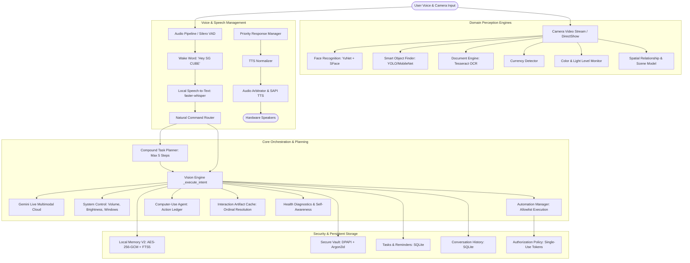
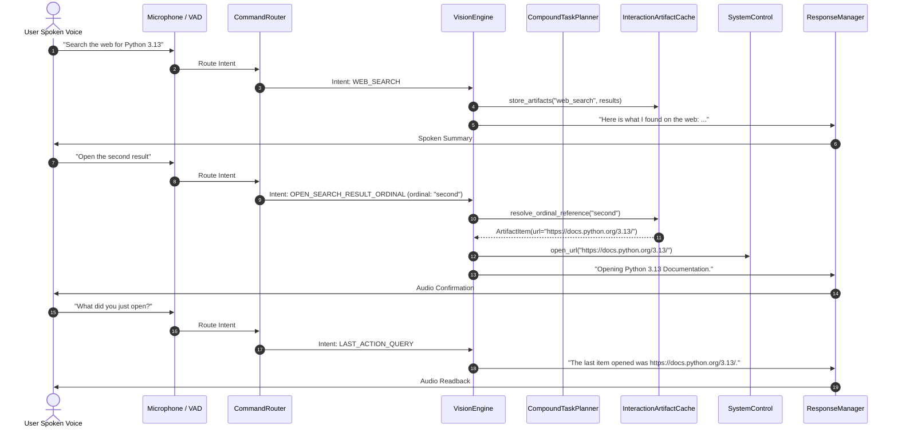

# SG CUBE MASTER CAPABILITY MAP
**Architecture & Subsystem Interconnect Specification**  
**Version:** 2.5-JARVIS Enterprise  
**Generated:** 2026-09-28  

---

## 1. High-Level Subsystem Architecture

---

## 2. Integrated Reference Repository Architectural Patterns

### A. Steven Saint JARVIS (`stevensaint/jarvis`)
- **Native Hardware Volume:** Implemented via Pycaw `IAudioEndpointVolume` with scalar readback verification in `assistive/system_control.py`.
- **Display Brightness:** Implemented via PowerShell CIM queries to `root/wmi:WmiMonitorBrightnessMethods` with truthful hardware capability detection.
- **Window Management:** Win32 `user32.dll` foreground window manipulation (`ShowWindow` SW_MINIMIZE, SW_MAXIMIZE, SW_RESTORE, WM_CLOSE, Alt+Tab switching).
- **Desktop Navigation & Math:** Alt+Left/Right browser navigation, scrollwheel controls, and deterministic AST-isolated mathematical calculation.

### B. InterGenJLU JARVIS (`InterGenJLU/jarvis`)
- **Interaction Artifact Cache:** `assistive/interaction_artifacts.py` stores multi-result structures (web search results, OCR blocks, app listings) enabling natural follow-up ordinal resolution ("open the second result", "play the first one", "what was the last thing opened?").
- **TTS Text Normalization:** Multi-pass normalizer in `assistive/tts_normalizer.py` converts technical markdown, URLs, IP addresses, currencies, file paths, and units into spoken language prior to speech synthesis.
- **Action Ledger & Duplicate Protection:** Computer-use subsystem incorporates perceptual dHash frame hashing and action history hashing to prevent repeated unintended clicks and command loops.
- **Compound Task Planner:** `assistive/task_planner.py` extracts multi-clause imperative sentences, checks preconditions, bounds execution to 5 sequential steps, and provides emergency cancellation.
- **Self-Awareness & Diagnostics:** Truthful probing in `assistive/health_diagnostics.py` verifying internet DNS, camera availability, audio output level, microphone status, and database integrity.

### C. Rofiperlungoding JARVIS (`rofiperlungoding/jarvis`)
- **Single-Use Authorization Tokens:** Per-request isolated authorization tokens for protected operations with zero secret leakage in logs.
- **DPAPI Vault Hardening:** Windows native DPAPI sealing master encryption keys for the secure vault with Argon2id passphrase derivation.
- **Memory Boundary Isolation:** Clear separation between normal local recall and sensitive credential/vault storage.

---

## 3. Subsystem Domain Coverage

| # | Domain | Core Engine File | Key Interfaces |
|---|---|---|---|
| 1 | **Voice Interaction** | `assistive/meta_glass.py`, `assistive/audio_arbitrator.py` | Wake word, Silero VAD, faster-whisper, barge-in |
| 2 | **Multimodal Live** | `assistive/meta_glass.py`, `assistive/api_key_manager.py` | Gemini Live WebSocket, multi-key quota rotation |
| 3 | **Face Recognition** | `assistive/face_recognition.py`, `assistive/multi_person_tracker.py` | YuNet ONNX, SFace ONNX, centroid tracker |
| 4 | **Spatial & Scene** | `assistive/spatial_relationship_engine.py`, `assistive/safety_analyzer.py` | Surface queries, directional queries, obstacle safety |
| 5 | **Smart Finder** | `assistive/smart_object_finder.py` | Bounding box persistence, search guidance |
| 6 | **Document Understanding** | `assistive/document_understanding.py`, `assistive/ocr_engine.py` | Total extraction, key-value fields, tabular parsing |
| 7 | **Currency** | `assistive/currency_detector.py` | Color histogram + OCR denomination detection |
| 8 | **Color & Environment** | `assistive/color_detector.py`, `assistive/environment_monitor.py` | HSV color identification, ambient light monitoring |
| 9 | **Windows Automation** | `assistive/automation_manager.py`, `assistive/ui_automation_manager.py` | Strict allowlist, calc, notepad, explorer, browser, whatsapp, vscode, settings |
| 10 | **Computer-Use Agent** | `assistive/computer_use/` | Action ledger, perceptual dHash, DPI-aware coordinates |
| 11 | **Tasks & Reminders** | `assistive/task_manager.py` | SQLite tasks, background polling scheduler |
| 12 | **Secure Memory V2** | `assistive/local_memory_v2/`, `assistive/secure_vault/` | AES-256-GCM, FTS5 semantic recall, DPAPI vault |
| 13 | **Proactive Alerts** | `assistive/proactive_alert_manager.py` | Rate-limited assistive cues, pause/resume |
| 14 | **User Preferences** | `assistive/memory_store.py` | `preferences.json`, DPAPI-sealed credentials |
| 15 | **Compound System Control**| `assistive/system_control.py`, `assistive/task_planner.py`, `assistive/interaction_artifacts.py` | Pycaw volume, WMI brightness, window ops, ordinal resolution, 5-step decomposition |

---

## 4. End-to-End Execution Flow (Ordinal & Compound Example)

