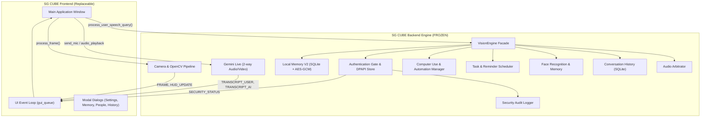

# SG CUBE — UI HANDOFF & BACKEND FREEZE SPECIFICATION
**Source of Truth:** `D:\VisionClaw-main`  
**Installed Target:** `C:\Users\Shara\AppData\Local\Programs\SG-CUBE`  
**Version:** 2.5.0-RELEASE (Backend Frozen)  
**Target Audience:** Future UI Redesign & Implementation Agents  

---

## 1. MISSION & MANDATORY RULES

### 1.1 Scope of Handoff
This document defines the formal, frozen interface contract between the **SG CUBE Core Backend** and the **SG CUBE User Interface**. 
A separate UI-focused coding agent will replace or redesign the frontend presentation layer.
The visual design, layout, styling, widgets, animations, colors, and presentation architecture are **100% replaceable**.
The backend logic, intelligence, hardware pipelines, speech architecture, memory systems, security gates, and automation engines are **100% frozen and protected**.

### 1.2 Absolute Invariants for UI Agents
1. **DO NOT MODIFY BACKEND SERVICES:** Do not refactor `assistive/`, `models/`, or background processes (`wake_listener.py`).
2. **DO NOT MOVE BUSINESS LOGIC INTO UI:** The UI is strictly an observer, presenter, and command initiator. It must never make authorization decisions, parse raw security audio, or manage database schemas.
3. **DO NOT BYPASS SECURITY BOUNDARIES:** The UI must never receive plaintext passwords, DPAPI keys, or raw AES-GCM decryption routines.
4. **LOCAL MEMORY IS THE SOLE MEMORY SYSTEM:** There is **NO** Global Memory. All memories go through `assistive/local_memory_v2`.
5. **FAIL-CLOSED ARCHITECTURE:** If an API call fails or authentication is missing, the backend fails closed; the UI must gracefully handle and display error states.

---

## A. CURRENT UI ARCHITECTURE

The current SG CUBE frontend is implemented in a single unified script:

### 1. Primary UI Entry Point
- **FILE:** `visionclaw_gui.py` (Lines 1 to 5859)
- **RESPONSIBILITY:**
  - Implements `SGCubeApp`, the main Tkinter application window, layout hierarchy, and event loop.
  - Hosts `ResponsiveDesignSystem` for dynamic proportional reflow and grid breakpoints across screen resolutions.
  - Houses custom UI drawing primitives: `GlowingHUDIcon`, `HUDTooltip`, `RoundedGlassCard`, `RoundedPill`, and `Real3DCubeRenderer`.
  - Manages background daemon threads: `_camera_loop`, `_ai_worker_thread`, `_audio_playback_loop`, and IPC server socket.
  - Consumes thread-safe events via `gui_queue` in `_process_gui_queue` on Tkinter's main thread.
  - Spawns secondary modal dialogs: History, Memory, Vision Diagnostics, People / Face Profiles, Meta Glass, and Settings.
- **BACKEND DEPENDENCIES:**
  - `assistive.vision_engine.VisionEngine`: Primary backend facade.
  - `assistive.command_router.OFFICIAL_INTRODUCTION`: Canonical voice introduction string.
  - `assistive.security_manager.SecurityState`: Enum for security state machine.
  - `google.genai` SDK: Realtime bidirectional Gemini Live streaming.
  - `sounddevice`: 16kHz audio capture and 24kHz audio playback.
  - `cv2` (OpenCV) & `PIL`: Video frame capture, color conversion, and rendering.
- **IMPORTANT PUBLIC INTERFACES:**
  - `main()`: Process bootstrap, single-instance verification, and Tk root loop.
  - `SGCubeApp.bring_to_foreground()`: Deiconifies window, pauses wake listener, starts camera and audio session.
  - `SGCubeApp.enter_sleep_mode()`: Plays farewell, shuts down mic/camera, hides window, resumes background wake listener.
  - `SGCubeApp.set_state(state: str)`: Updates central session state machine.
  - `SGCubeApp.gui_queue`: Central `queue.Queue()` for asynchronous UI updates from background threads.
- **SAFE TO REPLACE:** **YES**. The entire Tkinter GUI in `visionclaw_gui.py` may be replaced with a modern desktop UI framework (e.g., PySide6 / PyQt, Webview/Tauri, Electron, or a modern GUI architecture), provided it respects the contracts defined in this document.

### 2. Standalone Wake Daemon
- **FILE:** `wake_listener.py`
- **RESPONSIBILITY:**
  - Lightweight, always-on background microphone listener running independently of the main GUI.
  - Detects spoken hotwords ("SG CUBE", "Hey SG CUBE") via Porcupine / openwake_word / offline acoustic matching.
  - Dispatches `WAKE_FOREGROUND\n` IPC signal to port 49152 to wake the main GUI.
  - Listens on port 49153 for `PAUSE_WAKE_LISTENING` and `RESUME_WAKE_LISTENING` commands from the GUI to prevent microphone contention.
- **BACKEND DEPENDENCIES:** `wake_word_matcher.py`, PyAudio / sounddevice.
- **IMPORTANT PUBLIC INTERFACES:**
  - IPC Port `49153` (TCP Socket): Command channel (`PAUSE_WAKE_LISTENING\n`, `RESUME_WAKE_LISTENING\n`).
- **SAFE TO REPLACE:** **NO**. This is a headless backend support daemon. The UI only communicates with it via TCP IPC.

---

## B. BACKEND CONTRACTS

Every capability exposed by the backend to the UI is detailed below:



### 1. Camera Streaming & Ingestion
- **CAPABILITY:** Real-time camera capture from local webcam or Meta Glass.
- **INPUT:** Frame interval / target FPS (default 20 FPS).
- **OUTPUT:** Captured `cv2` BGR frame (numpy ndarray, typically 640x480 or 1280x720).
- **EVENTS/CALLBACKS:**
  - `gui_queue.put(("CAMERA_STATUS", "● LIVE <fps> FPS"))`
  - `gui_queue.put(("FRAME", <PIL.Image>))`
  - `gui_queue.put(("CAMERA_STOPPED", None))`
- **CURRENT METHOD/FUNCTION:** `VisionEngine.process_frame(frame: np.ndarray) -> Dict`
- **DATA FORMAT:** Numpy array (BGR) -> PIL Image (RGB) for display.
- **THREAD/ASYNC REQUIREMENTS:** Must run on a dedicated worker thread (`_camera_loop`). Never capture or process frames on the UI rendering thread.
- **DO NOT BREAK:** Frame capture rate must maintain >= 15 FPS; frame must be shared via thread-safe lock (`self.frame_lock`) with the Gemini Live video sender.

### 2. Live Vision HUD Telemetry
- **CAPABILITY:** Real-time environmental perception, hazards, scene analysis, and multi-person tracking.
- **INPUT:** Video frame (`np.ndarray`).
- **OUTPUT:** Structured perception dictionary:
  ```json
  {
    "faces": [{"name": "Sharan", "box": [y1, x1, y2, x2], "confidence": 0.94, "should_greet": false}],
    "safety": {"hazard_detected": false, "warning_text": ""},
    "environment": {
      "light_level": "NORMAL",
      "light_desc": "Normal lighting",
      "scene_summary": "Living Room",
      "people_count": 1,
      "object_count": 3,
      "scene_objects": [{"class_name": "cup", "relative_position": {"h_zone": "left"}}],
      "obstructions": []
    },
    "objects": [...],
    "people_awareness": {
      "total_people": 1,
      "known_names": ["Sharan"]
    }
  }
  ```
- **EVENTS/CALLBACKS:** `gui_queue.put(("HUD_UPDATE", hud_payload))`
- **CURRENT METHOD/FUNCTION:** `VisionEngine.process_frame()` called at ~2-5 Hz perception cadence.
- **DATA FORMAT:** Python `dict` with native strings, floats, ints, lists.
- **THREAD/ASYNC REQUIREMENTS:** Background thread execution; UI updates via queue.
- **DO NOT BREAK:** Must not block camera video streaming when complex inference runs.

### 3. Gemini Live Conversation & Audio Streaming
- **CAPABILITY:** Low-latency, full-duplex conversational voice interface with multimodal video streaming.
- **INPUT:** 
  - Mic PCM: 16,000 Hz, 16-bit signed integer, mono PCM chunks.
  - Video: JPEG-compressed keyframes sent at 1.0s intervals.
- **OUTPUT:** 
  - Audio PCM: 24,000 Hz, 16-bit signed integer, mono PCM.
  - Streaming real-time input transcripts (`server_content.input_transcription.text`).
  - Streaming output transcripts (`server_content.output_transcription.text`).
  - Tool calls: `get_ambient_status`, `scan_product_details`, `enroll_person_face`, `save_reminder_note`, `recall_user_memory`, `manage_voice_security`.
- **EVENTS/CALLBACKS:**
  - `gui_queue.put(("TRANSCRIPT_USER", <text>))`
  - `gui_queue.put(("TRANSCRIPT_AI", <text>))`
  - Audio playback dispatched to `playback_queue`.
- **CURRENT METHOD/FUNCTION:** `google.genai.Client.aio.live.connect(model="gemini-2.0-flash-exp", config=...)`
- **DATA FORMAT:** Raw binary PCM chunks, Protobuf messages.
- **THREAD/ASYNC REQUIREMENTS:** Asyncio event loop running inside dedicated background worker thread (`_ai_worker_thread`).
- **DO NOT BREAK:** Barge-in handling must instantly flush playback queue (`_clear_playback_queue()`) and increment `current_response_id` to drop stale in-flight packets.

### 4. Audio Arbitration & Security Challenge Gate
- **CAPABILITY:** Coordinates microphone ownership between Gemini Live and Local Offline Security Verification.
- **INPUT:** Voice audio stream during security challenges.
- **OUTPUT:** Local speech response via Windows SAPI / Gemini Live; security status.
- **EVENTS/CALLBACKS:**
  - `gui_queue.put(("SECURITY_STATUS", "Listening..."))`
  - `gui_queue.put(("SECURITY_STATUS", "Verifying..."))`
  - `gui_queue.put(("SECURITY_STATUS", "Access granted"))`
  - `gui_queue.put(("SECURITY_STATUS", "Access denied"))`
- **CURRENT METHOD/FUNCTION:** `VisionEngine.audio_arbitrator`:
  - `enter_security_challenge()`
  - `return_to_gemini()`
  - `is_security_mic_allowed()`
- **DATA FORMAT:** Binary PCM (16kHz).
- **THREAD/ASYNC REQUIREMENTS:** Synchronous lock-guaranteed state transition.
- **DO NOT BREAK:** **CRITICAL:** When security mode is active, microphone audio MUST NEVER be transmitted to Gemini Live. Audio is routed exclusively to `VisionEngine.process_security_challenge_audio()`.

### 5. Local Memory V2 (Normal & Sensitive Storage)
- **CAPABILITY:** Complete CRUD operations for personal context memories.
- **INPUT:**
  - `category`: String (e.g. `personal`, `preference`, `location`, `sensitive`).
  - `key_phrase`: String query identifier.
  - `fact_value`: Memory content.
  - `is_sensitive`: Boolean.
  - `auth_token`: Optional single-use ephemeral token (`SingleUseAuthToken`) for sensitive records.
- **OUTPUT:**
  - `save_memory(...) -> (bool, str)`
  - `recall_memory(...) -> (Optional[str], str)` (Status: `SUCCESS`, `AUTHENTICATION_REQUIRED`, `LOCKED_OUT`, `NOT_FOUND`).
  - `search_memories(...) -> List[Dict[str, Any]]`
  - `list_memories(...) -> List[Dict[str, Any]]`
  - `forget_memory(...) -> (bool, str)`
- **EVENTS/CALLBACKS:** `gui_queue.put(("TRANSCRIPT_ASSISTIVE", <spoken_confirmation>))`
- **CURRENT METHOD/FUNCTION:** `VisionEngine.local_memory.*` (facade in `assistive/local_memory_v2/service.py`).
- **DATA FORMAT:** Encrypted AES-256-GCM ciphertext for sensitive records; plaintext SQLite rows for normal records.
- **THREAD/ASYNC REQUIREMENTS:** Thread-safe SQLite database with WAL mode enabled.
- **DO NOT BREAK:** Sensitive records must reject any read/write without a fresh, unconsumed `auth_token`.

### 6. Voice Security Password Management
- **CAPABILITY:** Typed setup, typed change, recovery reset, and voice verification.
- **INPUT:**
  - Setup/Change: Typed strings only.
  - Spoken Verification: Audio PCM buffer or localized Whisper transcript.
- **OUTPUT:**
  - `setup_password(typed, confirm) -> (bool, msg)`
  - `change_password(old, new, confirm) -> (bool, msg)`
  - `reset_with_recovery_code(code, new) -> (bool, msg, new_code)`
  - `remove_password(typed) -> (bool, msg)`
  - Spoken challenge prompt: `"This is a protected action and protected information. Please speak your voice password."`
- **EVENTS/CALLBACKS:** UI updates security pill/status.
- **CURRENT METHOD/FUNCTION:** `VisionEngine.security` & `VisionEngine.local_memory`.
- **DATA FORMAT:** Salted Argon2id hash (`argon2_verifier.json`) and DPAPI-encrypted phonetic tokens (`phonetic_verifier.dpapi`).
- **THREAD/ASYNC REQUIREMENTS:** Argon2id hashing takes ~100-200ms (t=2, m=64MB); execute off the main UI thread.
- **DO NOT BREAK:** 3 failed spoken attempts must trigger persistent 5-minute lockout (`lockout_state.json`).

### 7. Conversation History
- **CAPABILITY:** Stores and retrieves turn-by-turn dialogue sessions.
- **INPUT:**
  - `session_id`: Unique string ID.
  - `role`: `"user"` | `"assistant"`.
  - `text`: Message transcript (passwords redacted to `"[VOICE_PASSWORD_REDACTED]"`).
- **OUTPUT:**
  - `create_session() -> str`
  - `get_session_messages(session_id) -> List[Dict[str, Any]]`
  - `get_recent_history(limit=5) -> List[Dict[str, Any]]`
  - `export_history_json() -> str`
- **CURRENT METHOD/FUNCTION:** `VisionEngine.history` (`assistive/conversation_history.py`).
- **DATA FORMAT:** SQLite records in `conversation_history.db`.
- **DO NOT BREAK:** User utterances must never leak voice passwords into database rows.

### 8. Face Enrollment & Profiles
- **CAPABILITY:** Enrolls new face profiles and recognizes known people in view.
- **INPUT:** Video frame (`np.ndarray`), person name string.
- **OUTPUT:** Face bounding boxes, enrolled feature vectors, recognition match confidence.
- **CURRENT METHOD/FUNCTION:** `VisionEngine.face_recognizer`, `VisionEngine.face_memory`, `VisionEngine.enrollment_session`.
- **DATA FORMAT:** 512-d embeddings stored under user profile directory.
- **DO NOT BREAK:** Active face enrollment provides real-time spoken guidance ("Look left", "Look right", "Hold still").

### 9. Meta Glass Smart Glasses
- **CAPABILITY:** Switches video input stream between laptop webcam and Meta Glass WiFi/RTSP camera.
- **INPUT:** RTSP / HTTP stream URL, battery/connection telemetry.
- **OUTPUT:** Frame generator, connection status string (`"CONNECTED"`, `"STREAMING"`, `"DISCONNECTED"`).
- **CURRENT METHOD/FUNCTION:** `VisionEngine.meta_glass` (`assistive/meta_glass.py`).
- **DATA FORMAT:** OpenCV capture from network stream.
- **DO NOT BREAK:** Fallback to laptop webcam if Meta Glass stream drops.

### 10. Task Reminders & Alarms
- **CAPABILITY:** Natural language task management, alarms, timers, recurring reminders.
- **INPUT:** Natural language queries (e.g. "Remind me to take medication at 8 PM").
- **OUTPUT:** Scheduled task items, active reminders, due notifications.
- **CURRENT METHOD/FUNCTION:** `VisionEngine.task_manager` & `ReminderScheduler` (`assistive/task_manager.py`).
- **DATA FORMAT:** SQLite rows in `tasks.db`.
- **THREAD/ASYNC REQUIREMENTS:** Background daemon thread runs 1-second cadence to check and dispatch due reminders.
- **DO NOT BREAK:** Missed reminders across sleep/reboot must be surfaced upon application startup.

### 11. Computer Use & OS Automation
- **CAPABILITY:** Desktop screen reading, mouse/keyboard automation, application launching, browser search, and media control.
- **INPUT:** Goal strings (e.g. "Open YouTube and play jazz music", "Read this document on screen").
- **OUTPUT:** Automation execution steps, success/failure status, spoken confirmations.
- **CURRENT METHOD/FUNCTION:** `VisionEngine.automation_manager` (`assistive/automation_manager.py`) and `assistive/computer_use/agent.py`.
- **SECURITY / SAFETY GUARD:** High-risk actions (closing unsaved apps, locking workstation, deleting files) require voice password confirmation.
- **DO NOT BREAK:** Emergency abort key (`Esc` or spoken "Stop automation") must halt execution within 200ms.

### 12. Single-Instance & IPC Lifecycle
- **CAPABILITY:** Enforces single running instance and coordinates wake events with background daemon.
- **PORTS:**
  - `49152` (TCP): GUI Single-Instance Lock & Command Receiver.
  - `49153` (TCP): Wake Listener Command Receiver.
  - `49154` (TCP): Wake Listener Single-Instance Lock.
- **IPC MESSAGES:**
  - GUI receives: `WAKE_FOREGROUND\n`, `HEALTH_CHECK\n`, `CLOSE_APP\n`.
  - GUI sends: `PAUSE_WAKE_LISTENING\n`, `RESUME_WAKE_LISTENING\n`.
- **DO NOT BREAK:** Port 49152 must be gracefully released on exit (`lock_socket.close()`).

---

## C. UI DATA CONTRACT

The table below defines every data structure sent from the backend to the UI presentation layer:

| Domain | Payload Key / Type | Content Description |
|---|---|---|
| **Camera** | `FRAME` (`PIL.Image`) | RGB image of current video feed sized to viewport. |
| **Camera** | `CAMERA_STATUS` (`str`) | Status string: `"● LIVE 20 FPS"`, `"● META GLASS"`, `"● RECONNECTING"`, `"OFFLINE"`. |
| **Vision** | `HUD_UPDATE` (`dict`) | Environmental metrics: people, room, light, noise, safety hazards, detected objects, obstruction zones. |
| **Voice** | `TRANSCRIPT_USER` (`str`) | Live transcription of user speech (`"[Protected Security Input]"` during password verification). |
| **Voice** | `TRANSCRIPT_AI` (`str`) | Streaming or finalized assistant response text. |
| **Voice** | `TRANSCRIPT_ASSISTIVE` (`str`)| Local offline system speech responses (safety, alerts, reminders). |
| **Voice** | `SECURITY_STATUS` (`str`)| Security gate states: `"Listening..."`, `"Verifying..."`, `"Access granted"`, `"Access denied"`. |
| **System** | `STATE` (`str`) | Central session state (e.g. `IDLE`, `LISTENING`, `AI_SPEAKING`, `SLEEPING`). |
| **System** | `info_status_labels` (`dict`)| Status indicators for Camera, Mic, Speaker, Gemini, Battery, Network. |
| **History** | `info_history_rows` (`list`) | Last 5 conversation events: `(timestamp, speaker, message_preview)`. |

---

## D. UI REPLACEMENT CONTRACT

Future UI agents MUST adhere to these design and architectural rules:

1. **State-Driven Presentation:** The UI must be a pure projection of the backend's state machine. Do not duplicate state in the UI.
2. **Asynchronous Dispatch:** All interactions with `VisionEngine` that take > 15ms (AI generation, database queries, camera restarts, password hashing) must be invoked on worker threads or background tasks.
3. **Queue / Event Consumer:** The UI must poll or bind to `gui_queue` (or an equivalent thread-safe callback bus) to receive updates without freezing the renderer.
4. **No Direct DPAPI / SQLite Access:** The UI must communicate exclusively through `VisionEngine`, `LocalMemoryService`, `SecurityManager`, and `TaskManager` public methods.
5. **No Password Interception:** Password input in modal dialogs must use masked entries (`show="•"`). Raw strings are passed directly to `security.set_password()` or `security.change_password()` and immediately dereferenced.

---

## E. SECURITY BOUNDARY SPECIFICATION

```
+-------------------------------------------------------------------+
|                        FRONTEND / UI LAYER                         |
|  - Renders masked password inputs ("••••••")                       |
|  - Renders safe status pills ("Verifying...", "Access granted")     |
|  - NEVER accesses raw DPAPI keys or AES-256-GCM cipher routines    |
+-------------------------------------------------------------------+
                                  |
               [Strict Separation / Auth Token Boundary]
                                  |
                                  v
+-------------------------------------------------------------------+
|                     LOCAL MEMORY V2 BACKEND                       |
|  - Salted Argon2id Verifier (argon2_verifier.json)                |
|  - Windows DPAPI Master Key Store (master_key.dpapi)              |
|  - Protected Phonetic Tokens (phonetic_verifier.dpapi)            |
|  - AES-256-GCM Record Encryption (local_memory_v2.db)             |
|  - Single-Use Ephemeral Token Validator (15-sec TTL)             |
|  - Persistent 3-Attempt Lockout Manager (lockout_state.json)      |
|  - Sanitized Security Audit Trail (security_audit.log)            |
+-------------------------------------------------------------------+
```

### Security Invariants:
- The UI **NEVER** receives the plaintext master encryption key.
- The UI **NEVER** logs or displays voice password transcripts. Transcripts are redacted to `"[VOICE_PASSWORD_REDACTED]"` before reaching the UI or SQLite history.
- The UI **NEVER** makes authorization decisions. It only passes user actions to `AuthenticationGate`.
- Sensitive memory recall operations require a single-use token obtained via spoken voice password verification.

---

## F. REQUIRED LIVE UI STATES

The UI must support rendering for all of the following system states:

| State Identifier | Meaning & Trigger | Expected UI Behavior |
|---|---|---|
| `INITIALIZING` | Application booting, loading models | Display loading spinner or pulsing core. |
| `IDLE` | Ready, camera active, awaiting speech | Calm orbital rotation, green status pill. |
| `LISTENING` | Microphone active, user speaking | Waveform animation, "Listening..." label. |
| `USER_SPEAKING` | Continuous speech incoming | Highlight user speech transcript container. |
| `AI_THINKING` | Query dispatched to Gemini / Local router | Pulsing glow on 3D centerpiece. |
| `AI_SPEAKING` | Audio streaming through 24kHz speaker | Waveform oscillation, speaking transcript visible. |
| `SECURITY_CHALLENGE` | Protected action initiated | Yellow/Cyan indicator: "Please speak your password". |
| `SECURITY_VERIFYING` | Spoken audio being matched against phonetics | Yellow status: "Verifying...". |
| `ACCESS_GRANTED` | Voice password matched | Flash green badge: "Access granted". |
| `ACCESS_DENIED` | Voice password mismatch or invalid token | Flash red badge: "Access denied". |
| `LOCKED_OUT` | 3 failed password attempts | Red alert pill: "Temporarily Locked (Xs remaining)". |
| `SAFETY_ALERT` | Physical obstacle or darkness detected | Red banner overlay on camera card with warning text. |
| `AUTOMATION_ACTIVE`| Computer-use goal executing | Blue badge: "Controlling Desktop...", show cancel button. |
| `RECONNECTING` | Transient network drop on Gemini stream | Amber badge: "● RECONNECTING". |
| `SLEEPING` | User requested sleep ("Go to sleep") | Window hidden/minimized, wake listener in standby. |
| `DISCONNECTED` | Gemini API key invalid / quota exceeded | Red badge: "Disconnected", prompt to open Settings. |

---

## G. CURRENT UI SCREENSHOT & COMPONENT HIERARCHY

### Component Tree:
```
Root Window (Tk: 1280x720 base, min 480x360, dark #050A07)
├── Header Bar (Height 86px, #08100C, border #234D39)
│   ├── Brand Container (38px 3D Cube Canvas + "SG CUBE" + Subtitle + Tagline)
│   ├── Centered Navigation (6 grid columns: Home, Vision, Memory, History, People, Meta Glass)
│   └── Actions Frame (Status Pill ["Listening...", waveform, dot] + Settings Gear Button)
├── Main Scrollable Canvas & Virtual Viewport
│   ├── Stage Upper (3-Column Grid Proportions: 25% | 50% | 25%)
│   │   ├── Environment Card (RoundedGlassCard: People, Room, Lighting, Noise, Safety)
│   │   ├── Camera Viewport Card (RoundedGlassCard: Live preview, Live badge, FPS pill, Toggle, Fullscreen)
│   │   └── Scene Card (RoundedGlassCard: People/Objects count, Left, Center, Right, Path obstruction)
│   └── Stage Lower (3-Column Grid Proportions: 35% | 30% | 35%)
│       ├── Recent History Card (RoundedGlassCard: Title, "View All >", 5 dense rows with time/speaker/text)
│       ├── Central 3D Cube (Real 3D canvas: 280x200px, rotating wireframe cube, interactive tilt, click-to-talk)
│       └── System Status Card (RoundedGlassCard: Camera, Mic, Speaker, AI Gemini, Battery, Network)
└── Footer Bar (Height 28px, #08100C, border #234D39)
    ├── Version Info ("SG CUBE 2.5.0 | Your Personal AI Companion")
    └── Dynamic Status / Clock Label
```

---

## H. UI REPLACEMENT REQUIREMENTS

### What the Future UI Agent CAN Redesign:
- Visual styling (Tailwind, Glassmorphism, Material, Fluent, or Cyberpunk themes).
- Color grading, palette, gradients, and font families.
- Component layouts (docked panels, split views, tabs, sidebars, bottom sheets).
- Animations (canvas-based, CSS3, Qt Quick / QML, OpenGL shaders).
- Camera display (picture-in-picture, background video, augmented reality overlays).
- 3D Cube visualizer (Three.js, Qt 3D, WebGL, custom shader mesh).
- Window framing (frameless, custom title bar, system native).

### What the Future UI Agent MUST NOT Break:
- Every capability in Section B must have a functional trigger or display binding in the new UI.
- Keyboard shortcuts (`Space` to talk, `Esc` to cancel/stop, `Ctrl+Shift+S` for settings).
- Background single-instance IPC sockets on ports 49152 and 49153.
- Redaction of voice passwords.
- Seamless wake/sleep roundtrip with `wake_listener.py`.

---

## I. RESPONSIVE GEOMETRY & DPI SPECIFICATION

### Supported Screen Resolutions:
The new UI must adapt cleanly across standard laptop and desktop resolutions:
- **1920x1080** (Full HD 16:9 standard desktop)
- **1680x1050** & **1600x900** (Medium laptop)
- **1440x900** & **1366x768** (Standard laptop display)
- **1280x720** (Default launch dimension)
- **1280x600**, **1024x768**, **1024x600** (Netbook / Ultra-mobile)
- **800x600** (Minimum supported boundary)

### Windows DPI Scaling Requirements:
- Windows systems commonly operate at **125%**, **150%**, or **175%** display scaling.
- The UI framework must declare Per-Monitor DPI awareness:
  ```python
  if os.name == 'nt':
      try:
          import ctypes
          ctypes.windll.shcore.SetProcessDpiAwareness(2) # Per-monitor DPI aware
      except Exception:
          pass
  ```
- Use scalable units (rem, percentage grids, or dynamic font-metrics) rather than hardcoded pixel bounds.

---

## J. BACKEND FREEZE DECLARATION

**STATUS:** **FROZEN**  
No modifications to `assistive/`, database schemas, crypto keys, or network protocols are permitted during UI development. All communication between the frontend and backend must strictly adhere to the contracts defined in this document.
